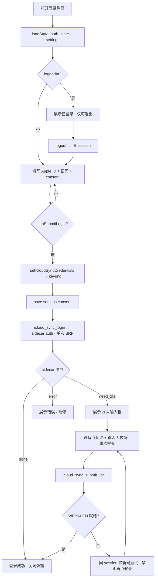
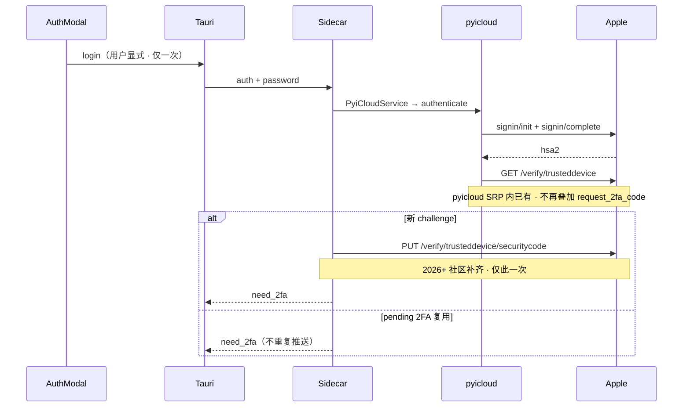
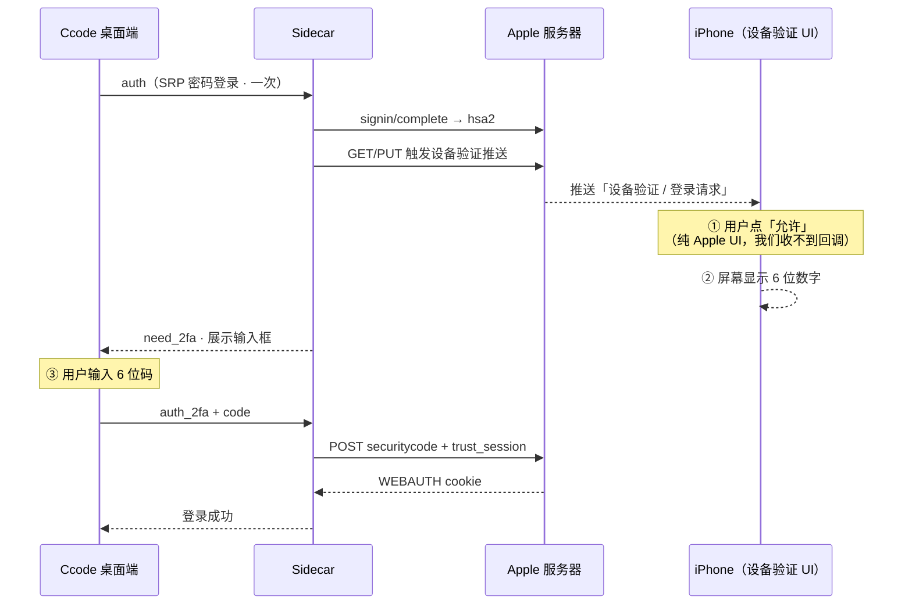
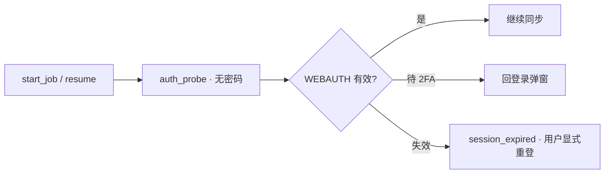
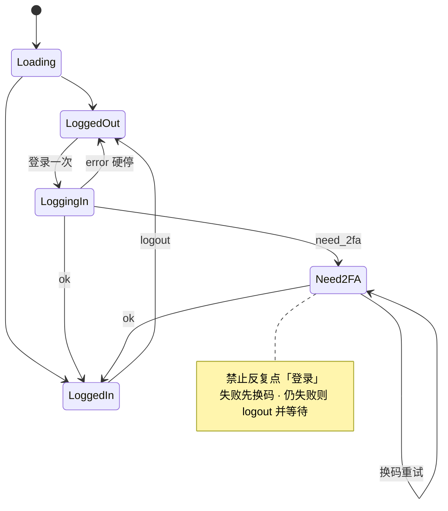
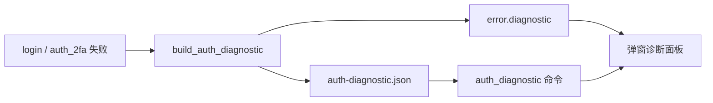

# iCloud 同步 — Apple ID 登录流程

**适用组件：** `IcloudSyncAuthModal.vue`  
**关联实现：** `apps/admin/src-tauri/src/icloud_sync/mod.rs`、`apps/admin/sidecar/icloudSync/agent.py`  
**设计原则：** **锁号风险最低** 为第一优先级；实现细节对齐 **icloud-photos-downloader / icloudpy / rclone** 社区已验证方案  
**最后对齐：** 2026-08-22

---

## 0. 锁号风险优先 — 设计原则

本功能**不是**「能登就行」，而是「**尽量少打 Apple 登录相关 API**」。下列为硬约束，代码与文档均不得违背：

| 优先级 | 原则 | 实现要点 |
|--------|------|----------|
| P0 | **密码 SRP 仅用户显式触发一次** | 弹窗「登录」→ 单次 `auth`；同步用 `auth_probe`，**不带密码** |
| P0 | **同一 2FA challenge 不重复推送** | `mfa_delivery_kicked_off`；pending 时不再次 `request_2fa` |
| P0 | **禁止 2FA 收尾阶段 SRP 重登** | 不用 `authenticate(force_refresh=True)` |
| P1 | **2FA 推送：icloudpd trigger_push_notification** | `_kickoff` 走 `pyicloud_ipd.trigger_push_notification` |
| P1 | **库：pyicloud_ipd @ icloudpd v1.32.3** | sidecar 依赖 GitHub 源码，不用 PyPI exe 包装 |
| P1 | **每条验证码：单路径、单次 trust** | legacy POST `securitycode`；至多 **1 次** `trust_session` 补 WEBAUTH |
| P1 | **不循环 accountLogin** | `trust_session` 内含 accountLogin，禁止外层再调 `_authenticate_with_token` |
| P2 | **失败硬停，由用户决定下一步** | 不后台自动重登；`account_locked` / `rate_limited` 立即停止 |

### 0.1 单次完整登录的 Apple API 预算（目标）

```text
SRP 登录（仅 1 次）     signin/init + signin/complete
2FA 触发（仅 1 次）     pyicloud: GET /verify/trusteddevice（SRP 内）
                       agent 补齐: PUT /verify/trusteddevice/securitycode（2026+ 社区）
验证码提交（仅 1 次）   POST /verify/trusteddevice/securitycode 或 SMS 等价端点
Session 收尾（至多 1 次） GET /2sv/trust + POST accountLogin（trust_session 内）
```

**不应出现：** 重复 bridge、`request_2fa_code` 二次推送、3 轮 trust 循环、同步任务携带密码 `auth`。

### 0.2 社区参考（非 Apple 官方文档）

| 来源 | 采纳内容 |
|------|----------|
| [icloud-photos-downloader PR #1335](https://github.com/icloud-photos-downloader/icloud_photos_downloader/pull/1335) | PUT 触发推送；`validate_2fa_code` → 单次 `trust_session` |
| [icloudpy PR #138](https://github.com/mandarons/icloudpy/pull/138) | iOS 26.4+ PUT 必需；失败非致命 |
| [rclone #9324](https://github.com/rclone/rclone/issues/9324) | 验证码与同一 `scnt`/session-id 绑定；禁止中途新 SRP |
| [pyicloud timlaing 2.6.x](https://github.com/timlaing/pyicloud) | SRP + session 落盘；**不**在应用层叠加 bridge 二次触发 |

---

## 1. 架构分层

```text
┌─────────────────────────────────────────────────────────────┐
│  IcloudSyncAuthModal.vue                                     │
│  consent 勾选 · 凭据表单 · 2FA 输入 · 登出                      │
└───────────────────────────┬─────────────────────────────────┘
                            │ invoke (Tauri)
┌───────────────────────────▼─────────────────────────────────┐
│  Rust icloud_sync/mod.rs                                     │
│  icloud_sync_login · icloud_sync_submit_2fa · logout         │
│  icloud_sync_auth_state · ensure_sidecar_authenticated       │
│  密码 → OS keyring；session → appData/icloud-sync/session/    │
└───────────────────────────┬─────────────────────────────────┘
                            │ stdin/stdout line-JSON
┌───────────────────────────▼─────────────────────────────────┐
│  Python sidecar agent.py + icloudAuth.py                     │
│  pyicloud_ipd（icloudpd v1.32.3 vendored）· trigger_push_notification │
└───────────────────────────┬─────────────────────────────────┘
                            ▼
                     Apple IDMS / iCloud API
```

---

## 2. 总览流程图



---

## 3. 首次登录（auth）— Sidecar 细节



### 3.1 为什么流程图里没有「点允许」这一步？

**「点允许」不是本应用的 API/代码步骤，而是 Apple 在 iPhone 上弹出的系统 UI。**

受信任设备验证（你手机上看到的「设备验证」）在 Apple 侧与在我们应用侧是 **两条并行线**：



| 步骤 | 发生在哪里 | 我们能否代劳 |
|------|------------|------------|
| 弹出「设备验证」 | iPhone | 否（由 PUT/GET/bridge 触发推送） |
| 点「允许」 | iPhone 系统界面 | **否**（无 Apple 开放 API） |
| 显示 6 位码 | iPhone 屏幕 | 否 |
| 输入并提交验证码 | Ccode 弹窗 | 是（`auth_2fa`） |
| 换取 WEBAUTH session | Sidecar → Apple | 是（`validate_2fa_code` + trust） |

因此文档/代码里的流程只写到 **我们能控制的 API**；「点允许」写在 **用户操作说明**（弹窗步骤列表、`loginFlow.md` 双端对照）里，而不会出现在 sidecar 命令序列中。

> pyicloud 另有 `_poll_trusted_device_completion`（仅点允许、不输入验证码的极少数路径），当前 UI **始终要求输入 6 位码**，与主号常见的「设备验证 → 允许 → 看码 → 输入」一致。

### 3.2 「完全登录」判定

`X-APPLE-WEBAUTH-TOKEN` cookie 存在 **且** `get_auth_status().authenticated === true`。  
缺 WEBAUTH 一律视为未完成，**禁止**向 UI 报「已登录可同步」。

---

## 4. 二次验证（auth_2fa）

```mermaid
flowchart TD
  A[用户提交 6 位码 · 一次] --> B[auth_2fa]
  B --> C{waiting_2fa?}
  C -->|否| X[error]
  C -->|是| D{delivery_method}

  D -->|sms| E[POST phone/securitycode]
  D -->|trusted_device / unknown| F[POST trusteddevice/securitycode]
  Note over F: icloudpd 同款 legacy POST · 不走 bridge

  E --> G{WEBAUTH 已有?}
  F --> G
  G -->|是| H[done]
  G -->|否| I[单次 trust_session]
  I --> J[等待 1s 查 cookie]
  J --> K{WEBAUTH?}
  K -->|是| H
  K -->|否| L[error · 保持 waiting_2fa · 用户换新码]

  style I fill:#e7f3ff
  style L fill:#fff3cd
  style H fill:#d4edda
```

### 4.1 与旧版差异（锁号导向）

| 旧做法 | 现做法 |
|--------|--------|
| PUT + `request_2fa_code` bridge 双触发 | 仅 PUT（SRP 内已有 GET） |
| trust + accountLogin 最多 3 轮 | **至多 1 次** `trust_session` |
| `trust_session` 后再调 `_authenticate_with_token` | 已删除重复 accountLogin |
| bridge `validate_2fa_code` | trusted_device 优先 legacy POST |

---

## 5. 同步前 session 探测（auth_probe）



---

## 6. 登出与换号

- **logout**：清 sidecar 内存 + 删除 session/cookie 文件  
- **换 Apple ID**：清旧 session 后走完整 auth（仍仅用户触发）  
- **已登录不可再 login**：须先 logout（防误触二次 SRP）

---

## 7. 前端弹窗状态机



---

## 8. 错误码与用户动作

| code | 含义 | 动作 |
|------|------|------|
| `need_2fa` | 待 2FA | 输入验证码 |
| `auth_failed` | 码错或未就绪 | 同弹窗换新码；**勿**再点登录 |
| `session_expired` | session 失效 | logout → 隔几小时再登一轮 |
| `account_locked` / `rate_limited` | 锁定/限流 | **立即停止**；iForgot / 官方网页 |

---

## 9. 实机操作建议

1. 重启 `cs:dev`（加载最新 agent.py）  
2. **退出登录**清半成品 session  
3. consent + 关闭 Advanced Data Protection  
4. **登录一次** → 允许 → **30 秒内**输入验证码  
5. 失败：同弹窗换新码；连续失败 → logout，**等待数小时**

---

## 10. 持久化

| 路径 | 内容 |
|------|------|
| keyring | 密码 |
| `{session_dir}/{appleId}.session` | pyicloud session |
| `{session_dir}/auth-diagnostic.json` | **最近一次认证诊断**（失败后可读，不含密码/验证码） |

---

## 11. 认证诊断（一次失败定位多类问题）

登录或 2FA 失败时，sidecar 会写入 `auth-diagnostic.json`，并在 error 事件里附带 `diagnostic` 字段。前端登录弹窗会**自动展开「认证诊断」面板**，无需再次登录即可读取上次报告。

### 采集项（flags）

| 字段 | 含义 |
|------|------|
| `hasWebauthToken` | Photos 所需 WEBAUTH cookie 是否就绪 |
| `hasScnt` / `hasSessionId` | 2FA 校验是否仍绑定同一 session |
| `bridgeActive` | pyicloud 受信任设备 bridge 是否在窗口内 |
| `deliveryMethodCached` / `deliveryMethodLive` | 2FA 投递方式（`unknown` 常见于设备验证） |
| `mfaDeliveryKickedOff` | 是否已触发推送（避免重复 kickoff） |
| `validatePath` / `kickoffPath` | 实际走的校验/触发路径（如 `put` / `bridge`） |

### 常见 hints → 含义

| hint | 通常根因 |
|------|----------|
| `WEBAUTH_MISSING_AFTER_2FA` | 码过期、未点「允许」、或 trust 未完成 |
| `MISSING_SCNT_OR_SESSION_ID` | session 断裂，需 logout 后重登 |
| `BRIDGE_INACTIVE_AT_VALIDATE` | 设备验证窗口超时 |
| `DELIVERY_METHOD_UNKNOWN` | iPhone 走「设备验证」但 API 未识别为 SMS |
| `NO_PENDING_2FA` | sidecar 无 pending challenge（勿连点登录） |
| `PARTIAL_SESSION_ON_DISK` | 磁盘有半成品 session，先 logout |
| `VALIDATE_RETURNED_FALSE` | Apple 拒绝验证码 |
| `VALIDATE_OK_WEBAUTH_PENDING` | 验证码已被 Apple 接受，但 trust/accountLogin 未写出 WEBAUTH |

### 使用方式

1. 失败后**不要立刻重试登录**；打开登录弹窗查看「认证诊断」  
2. 按 `userActions` 列表操作（与 hints 一一对应）  
3. 仍无法解决：点「复制诊断报告」，把 JSON 发给开发者一次性排查  



| `session/*.cookiejar` | `X-APPLE-WWEBAUTH-*` 等 cookie |

UI `loggedIn` 仅表示 session 文件存在；**同步以 `auth_probe` + WEBAUTH 为准**。
