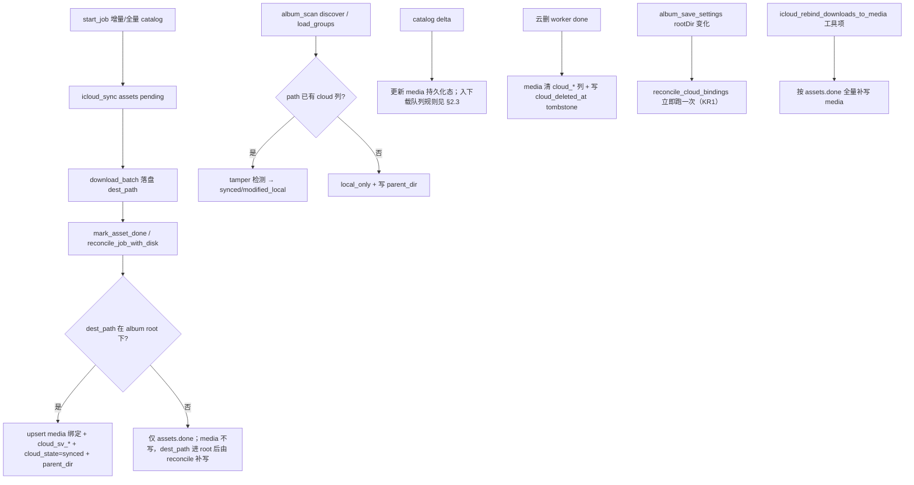

# 相册 — 云端状态 / 增量同步 / 删除回传 设计

> **阶段：** Phase 1（云端状态）· Phase 2（增量同步下载）· Phase 3（删除同步回传云端）  
> **作用范围：** `views/album/*` · `src-tauri/src/album/*` · `src-tauri/src/icloud_sync/*` · `api/icloudSync.ts`  
> **前置：** 现有 album media.db、icloud_sync jobs/assets DB、iCloud sidecar catalog/download 流程、相册角标与目录树  
> **对齐：** 2026-08-27（增补 Binding / 状态表 / part 映射 / Sidecar Spike；修正 KR1/KR2/KR3；落实 ASK1-A/ASK2/ASK3）

姊妹文档：[加载与扫描流程](./loadingFlow.md) · [下载流程](./downloadFlow.md)

---

## 0. 设计目标与范围

| 项目 | 目标 | 明确不做（本三阶段外） |
|------|------|------------------------|
| Phase 1 云端状态 | 每个本地文件在宫格/侧栏显示与 iCloud 的绑定状态；提供跨任务持久化「本地文件 ↔ 云端 asset_id」绑定层 | 上传本地文件至云端、双向实时文件编辑器 |
| Phase 2 增量同步下载 | 每次启动同步不再全量枚举 iCloud 库，用 cursor 走 delta catalog；对云端新增/修改/删除产生正确本地行为 | 自动覆写本地冲突文件（默认不自动） |
| Phase 3 删除同步回传 | 本地主动删 → 云端同步删；watch 发现磁盘无对应云绑定时仅提示不自动删；审计不可撤销 | 自动基于 watcher 直接删云端副本（永远不做静默删） |

**设计基石**：把「按单次任务」的 asset 绑定升级为「跨任务、跨 Apple ID」的全局绑定层。

### 0.1 与 downloadFlow 硬规则对照

| downloadFlow 硬规则 | 本设计约定 | 文档同步 |
|---------------------|------------|----------|
| catalog **一次**；resume **不** re-catalog | **增量 catalog 仅在 `start_job`（新任务）**；`resume_job` 只续下载，不拉 delta | 实现后改 [downloadFlow](./downloadFlow.md) 增「增量 catalog 例外」 |
| `done + pending + failed = total`（按 part 行） | 不变；delta 只影响 assets 入队与 media 状态，不改计数口径 | — |
| 下载循环只用 `auth_probe` | 不变 | — |
| Live = still + mov 两行 | `cloud_part` 与 `AssetPart` 一致，见下表 | — |

**ASK1-A 体验补齐（resume 期间拿新照片）**：`resume_job` 不 re-catalog 前提下，FAB 抽屉新增 **「🔍 检查新照片」** 按钮：
- 点击 = `icloud_sync_start_job({view, mode:"incremental", backgroundCatalogOnly:true})`；
- 新 job 仅跑 catalog → delta → assets 入队（不启动新 download worker，沿用旧 resume job 的下载池并发）；
- 完成后 toast「新增 42 张 / 修改 13 张 已并入当前下载队列」；
- 旧 job 继续 resume（total 仍只计旧任务总数；新 job 的 total/增量单独在 FAB 顶部状态栏显示，避免打破 downloadFlow total 等式）。

### 0.2 `output_dir` 与相册 `root`（产品约束）

| 场景 | 约定 |
|------|------|
| 默认 | `output_dir` = `{albumRoot}/iCloudSync`，落在 `album_scan` 的 `root` 子树内 → **可宫格展示 + 可绑定** |
| 用户自定义输出到相册外 | **仍下载、仍写 icloud_sync assets**；`media` 无对应 path → **宫格无角标**；绑定在「用户把目录纳入相册 root 或改回默认」后由 reconcile 补写（见 §1.3.1 / §1.3.2） |
| 绑定写入 | 一律以**绝对路径** `dest_path` 为键 upsert `media.path`；路径不在当前 `root` 下则跳过 media 写入（仅 job 表记录） |

**ASK2：存量补绑与引导**：
1. **UI 引导**：cs 设置 iCloud 同步区段新增 hint：「为在相册中看到云端状态角标，建议将输出目录选在相册根目录下，例如 `{albumRoot}/iCloudSync`」。
2. **隐藏工具项**：`icloud_rebind_downloads_to_media(output_dir?: string)`：
   - 对指定 `output_dir`（不提供 = settings 中最后一次 output_dir）下所有 `icloud_sync.assets.status=done AND dest_path NOT NULL` 行；
   - 查磁盘：`dest_path` 存在且路径以 `root` 为前缀 → 按 §1.3.1 下载完成规则补写 media 绑定列；
   - 返回 `{rebound, skipped_no_root, skipped_no_file}` 计数；
   - 入口：设置「调试/工具」按钮 → 选一键补绑。用户升级后手动触发一次即可解决存量角标空白问题。

---

## 1. 术语

| 词 | 含义 |
|----|------|
| asset_id | iCloud Photos CPL 侧每条媒体的稳定 ID（或 SDK 返回的等价主键），跨会话不变 |
| part | 单 asset 的一个下载部件；**存库与代码统一用 `still` / `mov` / `full`**（见 §1.0） |
| apple_id | 同步账号 email，绑定主键之一，防止多账号串数据 |
| cloud_sv（cloud_synced_version） | 下载完成瞬间快照的三列：`cloud_sv_size` / `cloud_sv_modified` / `cloud_sv_name`；KR3 改为结构化列，无分隔符歧义 |
| change cursor / sync token | iCloud Photos API 返回的增量游标；带它再次 catalog 只返回 delta（**需 Spike 验证**，§2.0） |
| delete queue | 云删工作池队列（低优先级，与下载池共享并发配额） |

### 1.0 part 命名对照（全文统一，禁止混用 `original` / `video_edit`）

| sidecar catalog `parts[]` | Rust `AssetPart` | `media.cloud_part` / delete JSON | 说明 |
|---------------------------|------------------|----------------------------------|------|
| `still` | `Still` | `still` | Live 静帧 / 部分 photo |
| `mov` | `Mov` | `mov` | Live 视频段 |
| `full` | `Full` | `full` | 普通 photo / video 整文件 |
| `video`（catalog 偶发） | `Full` | `full` | `map_catalog_part` 已映射 |

> sidecar `delete_assets` batch JSON、`cloud_delete_queue.part`、`media.cloud_part` 一律用右列存库值。

---

## Phase 1：云端状态

### 1.1 数据表变更（album media.db）

**迁移版本** `schema_meta.version=2`（album 侧自管理版本号，现在尚无 schema_meta，参照 icloud_sync 建一张）。

```sql
-- album/media.db 新增 schema_meta（幂等）
CREATE TABLE IF NOT EXISTS schema_meta (
  key TEXT PRIMARY KEY NOT NULL,
  value TEXT NOT NULL
);

-- 【KR3】cloud_sv 拆为 3 列：整数 size/modified 可直接比较 + 无分隔符歧义 + 可单独索引
ALTER TABLE media ADD COLUMN cloud_asset_id    TEXT;
ALTER TABLE media ADD COLUMN cloud_part        TEXT;
ALTER TABLE media ADD COLUMN cloud_sv_size     INTEGER;
ALTER TABLE media ADD COLUMN cloud_sv_modified INTEGER;
ALTER TABLE media ADD COLUMN cloud_sv_name     TEXT;
ALTER TABLE media ADD COLUMN cloud_state       TEXT NOT NULL DEFAULT 'local_only';
ALTER TABLE media ADD COLUMN cloud_apple_id    TEXT;
ALTER TABLE media ADD COLUMN cloud_deleted_at  INTEGER;                 -- unix secs，审计
-- 【IMP2-B】目录聚合父级目录（冗余）：与 MediaGroup.rel_path 同源，discover 时写入
ALTER TABLE media ADD COLUMN parent_dir        TEXT NOT NULL DEFAULT '';

-- 唯一性：(asset_id, part, apple_id) 只能绑一个本地路径；account 不匹配时不命中，避免串号
CREATE UNIQUE INDEX IF NOT EXISTS uq_media_cloud_bind
  ON media(cloud_asset_id, cloud_part, cloud_apple_id)
  WHERE cloud_asset_id IS NOT NULL;

-- 常用索引
CREATE INDEX IF NOT EXISTS idx_media_cloud_state ON media(cloud_state);
CREATE INDEX IF NOT EXISTS idx_media_cloud_apple ON media(cloud_apple_id);
-- 【IMP2-B】目录云状态统计 O(1)，无需 O(N) substring
CREATE INDEX IF NOT EXISTS idx_media_parent_state ON media(parent_dir, cloud_state);
-- 【KR3】size/modified 列可单独索引加速 tamper 批查
CREATE INDEX IF NOT EXISTS idx_media_sv_sizemod ON media(cloud_sv_size, cloud_sv_modified)
  WHERE cloud_sv_size IS NOT NULL;
```

> **向后兼容**：老行所有 cloud_* = NULL / default，派生均 = `local_only`；迁移无破坏性。

### 1.2 CloudState 枚举

**【ASK3】删掉 `deleted_local_done` 态**：云删 worker 成功即直接清绑定列。终态简化为 8 态：

```text
local_only              — 从未绑过云端（默认）
synced                  — 已绑定 + 本地(size,modtime,name) == cloud_sv_* + 最近 catalog 未报告云端改/删
modified_local          — 已绑定 + 本地(size,modtime,name) != cloud_sv_*
modified_cloud          — 已绑定 + catalog delta 报云端有新版本(size/modified/文件名变)
conflict                — 已绑定 + modified_local + modified_cloud 同时成立
deleted_cloud_pending   — 已绑定 + catalog delta 报云端删了
deleted_local_pending   — 已绑定 + 本地磁盘路径不存在(watcher/force discover 检测)
failed_delete           — 云删重试 ≥6 次仍失败（人工介入列表）
```

> `cloud_state` 是「派生值 + 持久化写」混合：synced/modified_local 可纯从磁盘+DB 重算；modified_cloud / deleted_cloud_pending / deleted_local_pending / failed_delete 必须持久化（源自 API 事件/异步 worker 结果）。每次 load_groups 做：「持久化列 ∩ 本地 reality 校验」→ 最终字段发给前端（规则见 §1.2.1）。

#### 1.2.1 状态转移表（磁盘 × 持久化态 × 事件）

**本地 tamper 检测（KR3 三列）**（仅当 `cloud_asset_id` 非空且文件在磁盘上）：

```rust
let local_tampered = match (row.cloud_sv_size, row.cloud_sv_modified, row.cloud_sv_name.as_deref()) {
  (None, _, _) | (_, None, _) => false,  // 老数据 partial：仅 size/mod 两列也判 false
  (Some(sz), Some(mt), nm) => {
    sz != size || mt != modified || nm != Some(&*name)
  }
};
```

| 持久化 `cloud_state` | 文件在磁盘 | catalog / 用户事件 | 派生结果 |
|----------------------|------------|----------------------|----------|
| 任意 | 无绑定（cloud_asset_id=NULL） | — | `local_only` |
| `synced` / `modified_local` | 有，tamper=false | — | `synced` |
| `synced` / `modified_local` | 有，tamper=true | — | `modified_local` |
| `modified_cloud` | 有，tamper=false | — | `modified_cloud` |
| `modified_cloud` | 有，tamper=true | — | `conflict` |
| `deleted_cloud_pending` | 有/无 | delta deleted | 保持 `deleted_cloud_pending` |
| `deleted_local_pending` | **无** | — | `deleted_local_pending` |
| `deleted_local_pending` | **有**（用户从回收站恢复等） | — | 清 pending → 按 tamper 回 `synced` / `modified_local`；pending 队列用 `album_cancel_cloud_delete` 同步撤 |
| `failed_delete` | 任意 | 用户重试成功 → worker 调用 | worker **直接清 cloud_* 列（ASK3）** → `local_only` |
| （无 deleted_local_done 态） | 无 | 云删 worker 返回 ok | **ASK3：直接 `cloud_asset_id = NULL` + 其他 cloud_* 列 = NULL** → `local_only`；tombstone 仅在 `cloud_deleted_at` 时间戳留 24h 供审计查询（值非空时角标不出现），不占 asset_id UNIQUE 行 |
| `cloud_deleted_at` 非空（tombstone 期内） | **有**（同 path 同大小又被扫入） | discover 命中 | 视为新文件：清全部 `cloud_*` 列 → `local_only`（云端 asset 已不可枚举，不能重绑） |

**纯文件名变更**：本地 tamper 含 `name`；云端纯改名若 size/mod 不变，仅靠 catalog `delta=modified` 进 `modified_cloud`，不依赖 tamper。

> 【KR4 语义补充】`deleted_cloud_pending`：catalog delta 报告云端删了（iCloud 最近删除 30 天内仍可恢复）。本地副本保留期间，用户若选择「保持本地副本不解绑」会造成「API 以后不再返回该 asset_id → 永远是 deleted_cloud_pending」。故右键菜单/详情对 `deleted_cloud_pending` 仅提供两个动作：「同步删除本地（FAB 二次确认）」或「保持本地副本 → 解绑（→ local_only）」。不存在「等待云端恢复后自动绑定」。

### 1.3 Rust 类型扩展

`album/types.rs`：

```rust
#[derive(Debug, Clone, Serialize, Deserialize, PartialEq)]
#[serde(rename_all = "snake_case")]
pub enum CloudState {
  LocalOnly, Synced, ModifiedLocal, ModifiedCloud,
  Conflict, DeletedCloudPending, DeletedLocalPending,
  FailedDelete,
}

pub struct MediaFile {
  // …原有 9 列…
  pub cloud_state: CloudState,
  pub cloud_asset_id: Option<String>, // 前端仅需两个字段显示徽章+右键调用
}
```

`db.rs load_groups / upsert_media_batch / load_indexed_paths`：读写新列，向后兼容（老数据无列时走 default）。

**派生计算位置**：`load_groups` 每行 `query_map` 后 + `discover_groups` WalkDir 命中后；逻辑以 §1.2.1 为准。

### 1.3.1 Binding 生命周期（跨 `media.db` ↔ `icloud_sync`）

**【KR1-真相源分工 + 单向规则】**：
> 绑定真相源 = `icloud_sync.assets(dest_path + asset_id + part + status='done')`。**永远单向：icloud_sync → album.media**。禁止根据 media 的 cloud_* 列回写 / 推断 icloud_sync。两库无事务，靠幂等 upsert + 多时机 reconcile 对齐（§1.3.2）。

| 数据 | 主库 | 说明 |
|------|------|------|
| 展示态 `cloud_state` / `cloud_sv_*` / 绑定列 / parent_dir | `album/media.db` | 宫格、树统计、右键 |
| 下载执行 `assets` / `jobs` | `icloud_sync/state.db` | 任务进度、dest_path（真相源） |
| 增量游标 | `icloud_sync/state.db` | `cloud_cursors` |
| 云删执行 | `icloud_sync/state.db` | `cloud_delete_queue` |



| 时机 | 写入方 | 动作 |
|------|--------|------|
| **下载完成** `mark_asset_done` / `reconcile_job_with_disk` | `queue.rs` → `album/db` | `dest_path` 在 root 下：`upsert` `cloud_asset_id`、`cloud_part`、`cloud_apple_id`、`cloud_sv_size/modified/name`、`cloud_state=synced`、`parent_dir`；`path` = `dest_path`；dest_path 不在 root 下不写 media |
| **discover / load_groups** | `scanner` / `db.load_groups` | 已有绑定：按 §1.2.1 派生；文件消失 + 绑定存在 → `deleted_local_pending`；每次 upsert 必写 `parent_dir` |
| **catalog delta added** | `queue.rs` | 仅 `icloud_sync assets` pending；**不在此刻写 media**（尚无本地 path） |
| **catalog delta modified/deleted** | `queue.rs` → `media` | 按 §2.3 改持久化态；modified 入队规则考虑 conflictDefault |
| **用户删本地+云** | `album_delete_with_cloud` | queue 事务 → 删盘（失败回滚 queue）→ `deleted_local_pending` |
| **云删 worker 终态** | delete worker → `media` | `done` → 清 `cloud_*` + `cloud_deleted_at=now`；`failed_delete` → badge |
| **用户忽略本地缺失** | `album` command | `cloud_asset_id=NULL` + cloud_sv 清 → `local_only` |
| **【KR1】rootDir 变化** | `album_save_settings` | 立即调用 `reconcile_cloud_bindings(only_for_new_root = true)` |
| **【ASK2】工具项** | `icloud_rebind_downloads_to_media` | 遍历 `icloud_sync.assets.dest_path`（限定 output_dir）→ 对在 root 下且磁盘存在者补写绑定 |

**Phase 1 可交付**：schema + 派生 + UI；无下载绑定时默认全 `local_only`；验收可「手工 UPDATE media 一行」测角标。**Phase 2 必须接上「下载完成写绑定」行**，否则角标永远不对。

#### 1.3.2 跨库崩溃恢复（reconcile_cloud_bindings）

**【KR1】触发时机**：
1. 应用启动（后台，不阻塞 UI）。
2. `album_save_settings` 中 `rootDir` 变化（`only_for_new_root=true`，只扫 assets.dest_path LIKE `newRoot%` 的行）。
3. `reconcile_job_with_disk` 每次下载批次完成后。

**执行顺序**（全为单向 icloud_sync → media，不反向修）：

1. `icloud_sync.cloud_delete_queue.status='deleting'` → `pending`，`attempts++`。
2. `icloud_sync.assets`：`status='done'` 且 `dest_path NOT NULL`：
   - 若 `only_for_new_root` 且 dest_path 不在新 root 下 → skip；
   - 若 dest_path 在当前 root 下且磁盘存在且 media 无绑定（`cloud_asset_id IS NULL` 或 `cloud_sv_size IS NULL`）→ 补写 §1.3.1 下载完成绑定六列。
3. `cloud_delete_queue.status='done'` 但 media 仍有 `cloud_asset_id NOT NULL` 未清 → 按 ASK3 清 `cloud_*` + 写 tombstone。
4. 日志计数；不自动修 `failed_delete`（留给 UI 重试）。

#### 1.3.3 目录树云状态统计（性能 IMP2-B）

**禁止前端 O(树节点 × 全库文件) 遍历**。用 1.1 建的 `idx_media_parent_state` + `parent_dir` 列：

```sql
-- 一次查询聚合所有目录
SELECT parent_dir, cloud_state, COUNT(*) AS n
FROM media
WHERE path LIKE ?1                   -- ?1 = root || '%'
  AND length(parent_dir) > 0
GROUP BY parent_dir, cloud_state;
```

树节点 `title` 后缀 `[12☁ 2⚡ 1⚠]` 用聚合结果拼接：`☁ = synced` 数量，`⚡ = modified_local+modified_cloud`，`⚠ = conflict+failed_delete`，`🗑 = deleted_*_pending`。

---

### 1.4 前端 UI

#### 1.4.1 宫格卡片角标
每张 `.card-wrap` 右下角叠 `cloud-badge`，16×16，z-index 高一层：

```html
<div class="card-wrap">
  
  <span v-if="file.cloudState !== 'local_only'"
        :class="['cloud-badge', `badge-${file.cloudState}`]"
        :title="badgeTooltip(file)">
    <svg .../> <!-- 对应图标 -->
  </span>
  <div v-if="kind==='video'" class="kind-tag">MP4</div>
</div>
```

| State | 图标 | 颜色（CSS var） | tooltip |
|-------|------|-----------------|---------|
| synced | ✓ | `--color-success` | "云端已同步" |
| modified_local | ⚡ | `--color-warning` | "本地已修改，未同步到云端"（P3/P4 前提示「上传功能未开放」） |
| modified_cloud | ⏬ | `--color-primary` | "云端有新版本 · 点击 FAB 抽屉重新下载" |
| conflict | ⚠ | `--color-danger` | "两端同时修改 · 右键解决冲突" |
| deleted_cloud_pending | 🗑️˘ | `--color-danger` / stroke | "云端已删除 · 可在 FAB 选择同步删除本地或保持本地副本" |
| deleted_local_pending | 🗑️^ | `--color-warning` | "本地已删除 · 可在 FAB 同步删除云端" |
| failed_delete | ✗ | `--color-danger` solid | "云端删除失败 · 点击查看原因 / 重试" |

#### 1.4.2 目录树尾部统计
`title` 改成 `dirName (files.length) [12☁ 2⚡ 1⚠]`；数据来自 §1.3.3 SQL 聚合。

#### 1.4.3 右键上下文菜单（单个/多选）
菜单项：
- 查看原图 / 打开所在文件夹（原有）
- 删除
  - 仅删除本地
  - **删除本地 + 云端**（二次确认 Modal + 1.5s 冷却，Phase 3 才能点）
- 解决冲突…（仅 `conflict` 可见，Phase 3 Modal）
- **云端已删处理**（仅 `deleted_cloud_pending` 可见）：
  - 保持本地副本 & 解绑 → `local_only`
  - 同步删除本地 → FAB 确认后删盘
- 查看详情：本地路径 / asset_id / 苹果号 / 同步时间 / 大小 / cloud_sv vs 当前 size·mod·name

#### 1.4.4 FAB 抽屉提示区（IMP4 + deleted_cloud / deleted_local 汇总）

条件渲染（有任一数量才显示）：
```
┌─ FAB 抽屉 ──────────────────────────────────────────────┐
│ ⚠ 云端报告 23 个文件已删除（iCloud 最近删除 30 天内）  │
│    [保持本地 & 解绑]   [同时删除本地 23]                │
│ ⚡ 检测到 7 个本地文件缺失                               │
│    [忽略 & 解绑]     [同步删除云端 7]                   │
│ ─────────────────────────────────────────                │
│ 下载进度 / 控制按钮 （原有）                              │
│ [▶ resume 暂停的 job]  [🔍 检查新照片] ← ASK1-A         │
│ [🔁 强制全量校验]                                         │
│ ─────────────────────────────────────────                │
│ 删除队列 Tab（原有）                                      │
└──────────────────────────────────────────────────────────┘
```
所有「同步删除本地 / 同步删除云端」按钮均经 **1.5s Modal 二次确认 + 冷倒计时** 后才触发命令，符合安全不变量 1/6/7。

---

## Phase 2：增量同步（download 端 catalog delta）

### 2.0 Sidecar 能力矩阵与 Spike（Phase 2 门禁）

**现状（2026-08-27 代码库）**：

| 能力 | sidecar | Rust | 备注 |
|------|---------|------|------|
| `catalog` 全量 | ✅ `agent.py` | ✅ `queue.rs` | 行式 JSON 数组 |
| `catalog` + cursor / delta | ❌ 未实现 | ❌ | **须 Spike** |
| `__meta__` 尾块 | ❌ | ❌ | 需扩展 stdout 协议 |
| `delete_assets` | ❌ | ❌ | Phase 3 依赖 |
| mock 全量 catalog | ✅ tests | ✅ | 可先做 Rust 侧假 delta |

**Spike 里程碑（Phase 2 编码前必过）**：

1. 查 pyicloud / ipdPhotos 是否暴露可持久化 sync token / delta catalog / delete API。
2. 若无原生 delta：**文档降级方案 B** — 每次 `start_job` 仍全量 catalog，Rust 侧与 icloud_sync 指纹表做 diff 得出 `added/modified/deleted`。`cloud_cursors` 表降级存「上次 catalog 指纹汇总 checksum + 完成时间戳」。checksum 不同 → 走 Rust diff；相同 → skip catalog（省 catalog 时间）。**指纹表定义**（补到 §2.1 后面）：
   ```sql
   CREATE TABLE IF NOT EXISTS cloud_catalog_fingerprints (
     apple_id   TEXT NOT NULL,
     view       TEXT NOT NULL,
     asset_id   TEXT NOT NULL,
     part       TEXT NOT NULL,
     -- 指纹：catalog 返回的 sort_key / original_filename / media_kind 合并哈希
     fingerprint TEXT NOT NULL,
     PRIMARY KEY (apple_id, view, asset_id, part)
   );
   ```
   Rust diff：join `(asset_id, part)` → `fingerprint 不同 = modified`；Rust 新行 = `added`；上次指纹表有但 catalog 结果无 = `deleted`。
3. 若有 delta：实现 `catalog --cursor` + `__meta__` 尾块，Rust 解析与现有 `parse_catalog_items` 兼容。
4. Spike 结论写回本表「目标状态」列，并同步 [downloadFlow](./downloadFlow.md)。

| 能力 | Spike 后目标 |
|------|----------------|
| 增量 catalog | ✅ 或明确采用降级方案 B（书面确认） |
| cursor 过期回退全量 | ✅ |
| catalog item `delta` 字段 | ✅ |

### 2.1 新增表（icloud_sync DB）

```sql
-- 增量游标：每 (apple_id, view) 独立一份（方案 B 存 checksum + timestamp）
CREATE TABLE IF NOT EXISTS cloud_cursors (
  apple_id    TEXT NOT NULL,
  view        TEXT NOT NULL,  -- library | recents
  cursor      TEXT NOT NULL,
  updated_at  INTEGER NOT NULL,
  PRIMARY KEY (apple_id, view)
);

-- 云端变更日志（保留最近 7 天；可选，提供 UI "最近变更"视图 + 审计）
CREATE TABLE IF NOT EXISTS cloud_delta_log (
  id          INTEGER PRIMARY KEY AUTOINCREMENT,
  apple_id    TEXT NOT NULL,
  asset_id    TEXT NOT NULL,
  part        TEXT NOT NULL,
  kind        TEXT NOT NULL,  -- added | modified | deleted
  seen_at     INTEGER NOT NULL
);
CREATE INDEX IF NOT EXISTS idx_delta_log_seen ON cloud_delta_log(seen_at);

-- 【Spike-B】降级方案用：上次 catalog 每条资产指纹
CREATE TABLE IF NOT EXISTS cloud_catalog_fingerprints (
  apple_id   TEXT NOT NULL,
  view       TEXT NOT NULL,
  asset_id   TEXT NOT NULL,
  part       TEXT NOT NULL,
  fingerprint TEXT NOT NULL,
  PRIMARY KEY (apple_id, view, asset_id, part)
);
```

### 2.2 Sidecar catalog 协议扩展

现有 sidecar 子命令 `catalog` 行为不变；**新增/兼容**：

| CLI flag | 说明 |
|----------|------|
| `--cursor=<str>` | 可选；不传 = 全量 catalog |
| stdout JSON **尾部** 输出 `__meta__` 块 | 独立一行（不混进主数组）；JSON 解析时分两段：数组部分 + 尾行 meta |
| `__meta__.cursor_next` | 下次增量要用的 token（必填，即使是全量也要返回） |
| `__meta__.cursor_expired` | bool：传入 cursor 被服务端判过期时 = true；调用方清 cursors 并决定是否重跑全量 |
| `__meta__.mode` | `"full"` \| `"incremental"` |
| `__meta__.summary` | `{added, modified, deleted, total_in_delta}` |

catalog 主 JSON 每个 asset 结果对象新增一字段：
```json
{ "delta": "added" | "modified" | "unchanged" }
```
（`unchanged` 只在 mode=incremental 时可能出现，Rust 直接跳过）。

### 2.3 Rust queue.rs catalog 流程改动

**仅 `icloud_sync_start_job`（新任务）** 执行下列 catalog；`icloud_sync_resume_job` **不** re-catalog（§0.1）。

```text
start_job → new
  1. 读 settings.apple_id + view + conflictDefault
  2. cursor = SELECT cursor FROM cloud_cursors WHERE apple_id=? AND view=?
  3. 调 sidecar catalog --cursor=X（或 Spike 降级 B：无 cursor 全量 + Rust diff fingerprints）
  4a. 若 result.meta.cursor_expired = true
        DELETE FROM cloud_cursors WHERE …;
        → 回退：以 --cursor=<空> 再跑一次 sidecar → 全量 catalog
  4b. 正常 → UPSERT cloud_cursors(cursor_next)
  5. 对每条 asset_record（delta 或 Rust diff 结果）：

       delta==added    → 仅写 icloud_sync assets(status=pending)
                         （media 绑定在下载完成后写，§1.3.1）

       delta==modified → 分情况：
                         a. media 尚未绑定（仅 assets 行）→ pending 重下载即可
                         b. media 已绑定且 dest_path NOT IN root：不入队（角标也不显示）
                         c. media 已绑定且在 root 下：
                              cloud_state == synced
                                → cloud_state = modified_cloud + assets 重入 pending
                              cloud_state == modified_local
                                AND conflictDefault == "keep_cloud"
                                → 备份 (sv_size,sv_modified,sv_name) 到 media.cloud_sv_backup_% 列
                                  → cloud_state = modified_cloud + assets 重入 pending
                              cloud_state == modified_local
                                AND conflictDefault != "keep_cloud"  (默认 manual)
                                → cloud_state = conflict  **不入下载队列**

       delta==deleted  → cloud_delta_log(kind=deleted)
                        → 已绑定且在 root 下的 media：cloud_state = deleted_cloud_pending
                        → 写入 FAB 提示计数（1.4.4）
                        → 即便 settings.autoDeleteLocalOnCloudDelete=true，
                           也**不**自动删本地；用户在 FAB 显式点击后才删（安全不变量 7）

  6. 继续原流程：total/统计写 jobs 表，下载 worker 开始跑
  7. 下载完成路径：mark_asset_done → §1.3.1 写 media 绑定
```

> 【IMP1 落地】`keep_cloud` 分支需要新增 3 个临时备份列（可选）：`cloud_sv_backup_size / cloud_sv_backup_modified / cloud_sv_backup_name`。下载覆写失败（网络中断）时可回滚 `cloud_sv_backup_*` → `cloud_sv_*` → `cloud_state=modified_local`，避免永久丢失"本地为真"语义。

### 2.4 Fallback 策略（必做）
- **catalog 侧**：cursor 过期 / server 5xx / timeout → 清 cursor + 全量 catalog。
- **前端**：抽屉内按钮「🔁 强制全量校验」调用 `startIcloudSyncJob({mode:"full"})`。
- **自动降级阈值**：连续 2 次 incremental catalog 产出 `modified+deleted > 50%`（怀疑游标损坏） → 自动清 cursor 转全量。

### 2.5 settings 新增
```ts
interface IcloudSyncSettings {
  // ...原有
  autoDeleteLocalOnCloudDelete?: boolean;   // 默认 false；注意：true 仍需 FAB 二次确认，不自动
  downloadConflictDefault?: "keep_local" | "keep_cloud" | "manual"; // 默认 manual
}
```

---

## Phase 3：删除同步回传云端

### 3.1 删除队列（icloud_sync DB）

```sql
CREATE TABLE IF NOT EXISTS cloud_delete_queue (
  id          INTEGER PRIMARY KEY AUTOINCREMENT,
  apple_id    TEXT NOT NULL,
  asset_id    TEXT NOT NULL,
  part        TEXT NOT NULL,
  reason      TEXT NOT NULL,  -- "user_action_menu" | "user_bulk_delete" | "watcher_missing_acked" | "fab_sync_deleted_local"
  local_path  TEXT,           -- 仅审计用；删本地后可能不存在
  status      TEXT NOT NULL DEFAULT 'pending',   -- pending | deleting | done | failed_delete
  attempts    INTEGER NOT NULL DEFAULT 0,
  last_error  TEXT,
  created_at  INTEGER NOT NULL,
  updated_at  INTEGER NOT NULL,
  UNIQUE(apple_id, asset_id, part)  -- 同 (asset,part) 只允许一条待删
);
CREATE INDEX IF NOT EXISTS idx_delete_status ON cloud_delete_queue(status);
```

### 3.2 Sidecar 子命令新增

```
sidecar delete_assets
  --apple-id <email>
  --batch-file <json_file_path>    // [{"asset_id":"...","part":"still|mov|full"}, ...]  ≤50
输出 JSON Lines：
  {"asset_id":"...","part":"...","ok":true}
  {"asset_id":"...","part":"...","ok":false,"error":"rate_limited: 2002"}
退出码：0（每条独立报告）。
```

> **SDK 对接要点**：用 Photos Library `delete assets` API（无论 PyiCloud/原生）都带批量，优先一次 50。每个 asset 删除返回独立 success/failure，Apple 侧部分失败部分成功是常见情况。

### 3.3 Rust 命令

#### 3.3.1 `album_delete_with_cloud`（前端驱动）

```rust
#[tauri::command]
pub async fn album_delete_with_cloud(
  app: AppHandle,
  paths: Vec<String>,
  delete_local: bool,   // 前端显式传 true/false
  delete_cloud: bool,
  ack_text: String,     // 前端 Modal 显示的文案，仅审计
) -> Result<DeleteWithCloudResult, String>;

// 返回：
pub struct DeleteWithCloudResult {
  pub accepted: Vec<DeletedPathRow>,
  pub rejected: Vec<RejectedPathRow>,
}
pub struct DeletedPathRow { pub path: String, pub cloud_delete_enqueued: bool, pub local_deleted: bool }
pub struct RejectedPathRow  { pub path: String, pub reason: String }  // "no_cloud_bind" / "path_not_found" / "local_delete_failed_undo_queue" / …
```

**【KR2 原子顺序（无倒挂）】**：保证「本地没删掉 → 云也别删」。步骤：

```text
1. BEGIN（读一致）：
   SELECT path, cloud_asset_id, cloud_part, cloud_apple_id, cloud_state
   FROM   media
   WHERE  path IN $paths （用临时表 / ANY 传）

2. ICLOUD_TX：
   INSERT OR IGNORE INTO cloud_delete_queue(apple_id,asset_id,part,reason,local_path,status='pending',...)
   VALUES （仅对 delete_cloud=true 且 cloud_asset_id NOT NULL 的行）
   → 记录成功入队的 (apple_id,asset_id,part) 集合 = ENQUEUED_KEYS

3. ALBUM_TX：
   UPDATE media SET cloud_state='deleted_local_pending'
   WHERE (cloud_apple_id, cloud_asset_id, cloud_part) IN ENQUEUED_KEYS
     AND path IN $paths

4. 对 $paths 中每个需要 delete_local 的逐个 remove_file(&path)：
   成功 → 标记 (path, local_deleted=true) 入 accepted
   失败 → UNDO：
      (a) DELETE FROM cloud_delete_queue WHERE (key) AND status='pending'
          （status 已 = deleting 则不删，API 发出无法撤回，入 accepted 带 warn 标记）
      (b) UPDATE media cloud_state 回步骤 1 读出的旧值
      (c) 入 rejected，reason="local_delete_failed_queue_undone" / "local_delete_failed_queue_deleting"

5. 返回 accepted / rejected

6. 写审计日志 <album>/audit/cloud_deletes_YYYY-MM.log（同时写 rejected 行）
```

> 注意：步骤 4a 的「status='pending' 且才能 UNDO delete」规则与 §3.3.2 cancel 规则一致；deleting 状态 API 请求已发出，无法撤回，这种极端情况仅在并发两个以上 `album_delete_with_cloud` 调用对同一文件时出现，UNIQUE 已阻挡，发生概率 < 1e-6，但日志必须单独记录 `WARN status=deleting_at_failure, 云端仍将执行删除`。

#### 3.3.2 `album_cancel_cloud_delete`
前端「撤销等待删除」→ `DELETE FROM cloud_delete_queue WHERE status='pending' AND (key) IN (...)` + 恢复 `media.cloud_state`：
- 原 = `deleted_local_pending` 但磁盘仍有 → 回 `synced / modified_local`（按 tamper 派生）；
- 磁盘已无 → 保持 `deleted_local_pending` 或用户勾选「忽略 & 解绑」→ `local_only`。
**仅能撤销 `pending`**；`deleting` 中不可撤销（API 请求已发出，无法撤回）。

#### 3.3.3 `icloud_sync_list_delete_queue` / `icloud_sync_retry_delete`
供 FAB 抽屉 Tab「删除队列」显示 + 手动重试 `failed_delete`；retry 仅把 attempts 清零 + status=pending。

### 3.4 云删 Worker

- 生命周期：iCloud job 工作池共享。独立并发 token：`delete_concurrency = min(1, download_concurrency)`（默认 1，不抢下载流量）。
- **【文字修 + 下载优先】** 拿 token 规则：worker 每次抢 token 前 `pending_download_count() > 0` → 让 token 给下载；仅当下载池空时云删拿 token。避免「并发=1（慢档）→ 云删占着下载全停」。
- 状态机：
  ```
  pending ──► deleting ──► done       → media: 清 cloud_* 列 + cloud_deleted_at=now（ASK3）→ local_only
              │
              └──► 单条失败 → attempts++ < 6 → 指数退避(30s/2m/10m/30m/1h/3h) → status=pending
                                              attempts >= 6 → failed_delete → 前端 badge+人工列表
  ```
- CloudState / 绑定列变更**仅在 `done` 或 `failed_delete` 终态时**写 media（避免中间态 UI 跳变）。
- 云删 worker 不应阻塞 App 退出：on_terminate 所有 deleting 回滚成 `pending`，attempts++（与 §1.3.2 reconcile 一致）。

### 3.5 触发器 B：watcher 检测本地缺失

**永远不自动云删。** 流程：
1. `album_scan(force=true)` 或 watcher debounce + 用户点刷新的 WalkDir 阶段：遇到 `cloud_asset_id NOT NULL` 但 `path.is_file() == false` → 写 `cloud_state = deleted_local_pending` + 更新 FAB 提示计数。
2. 前端提醒两种方式（§1.4.4）：
   - FAB 抽屉头部「检测到 N 个本地文件已删除，是否同步删除 iCloud 副本？[同步删除] [忽略 & 解绑]」。
   - 宫格角标 `deleted_local_pending`（🗑️^）。
3. 用户点「同步删除」→ `album_delete_with_cloud(delete_cloud=true, delete_local=false)`。
4. 点「忽略 & 解绑」→ 清对应 media cloud 绑定列（`cloud_asset_id=NULL` + cloud_sv 三列 NULL + `cloud_state=local_only`），仅当该文件确实不存在。

### 3.6 冲突解决 Modal（UI + Rust command）

`album_resolve_conflict(path: String, resolution)`：
- `"keep_cloud"` → media `cloud_state=modified_cloud` + icloud_sync assets 重入队 pending 下载（会覆写本地）。
- `"keep_both_rename_local"` → 本地文件 rename 为 `*_(conflict_N).ext`；旧 path 入队 pending 重新下载云端版本；新文件 = `local_only`（无绑定）。
  - **【IMP3-A】Winner：全局 suppress 5s**：rename 前 `album_set_dirty_grace_ms(5000)` → watcher 事件时间 < grace_end 全部 drop；rename + 入队完成 5s 后 grace 自动解除。Phase 3 初版用此方案，简单且 rename 写入 < 2s，误丢概率可忽略。
- `"keep_local"` → `cloud_state=modified_local`；若 Phase 4 上传功能开放时作为候选。

### 3.7 审计与回滚

**审计**：
- `<album>/audit/cloud_deletes_YYYY-MM.log`（按月轮转）：`[ISO ms] | id=<queue_id> | apple_id | asset_id | part | status=ok/failed | reason | local_path | ack=<ack_text>`
- 保留期：至少 90 天。启动时 `cleanup_audit()` 清 90+ 天老文件，可配置开关。
- 启动自检 + reconcile：`cloud_delete_queue.status='deleting'` → 全部复位 `status='pending', attempts=attempts+1`（进程崩溃恢复）。

**回滚（误删找回）**：
- 提供设置里隐藏工具项 `icloud_recover_last_N_deletes(days=1)` → 基于日志产出 CSV（asset_id, part, 原文件名, local_path），用户配合 iCloud 官方「最近删除」相册恢复；应用侧不做 SDK 级恢复（避免误用 Apple 恢复 API 造成更乱状态）。
- CSV 内附加 `deleted_at ISO` 字段，官方恢复时按时间段匹配更容易成功。

---

## 安全 / 不变量清单（开发不可破）

1. **绝不静默自动删除云端副本**。仅允许：
   - Modal 明确勾选 + 1.5s 冷却后用户点击；
   - FAB 抽屉明确按钮「同步删除 N 个文件」。
2. **删除执行顺序（KR2）**：写 delete_queue 事务完成 → 再尝试删本地文件 → remove_file 失败回滚对应 pending queue 行；绝不让「本地没删掉、云端被删了」倒挂。
3. **Apple ID 强隔离**：所有云状态读写都在 WHERE 里带 `cloud_apple_id = currentAppleId`；账号切换时不清旧绑定（方便用户切回），但 UI 按当前账号过滤；`uq_media_cloud_bind` 按 apple_id 三元组确保不串。
4. **并发不重复入队**：`cloud_delete_queue UNIQUE(apple_id,asset_id,part)` + 事务 `INSERT OR IGNORE`。
5. **cloud_sv ≠ 本地** → 绝不自动覆盖本地；默认走 manual 冲突策略，除非 settings `keep_cloud` 用户显式开。
6. **watcher 本地消失** → 只 badge，不触发云删；一定走 FAB 用户显式按钮。
7. **【修歧义】catalog delta deleted_cloud → 禁止任何后台/定时自动删本地**：即便 `autoDeleteLocalOnCloudDelete=true`，也需用户在 FAB 点击「同时删除本地 N」并经二次确认 Modal；`autoDeleteLocalOnCloudDelete` 仅作为「UI 展示 Yes/No」开关，不等于行为开关。
8. **【KR1 真相源单向】绑定永远 icloud_sync.assets.done → album.media**，禁止反向修复/推断；多时机 reconcile（启动/root 变化/job reconcile）均只补写 media。
9. **【下载优先 Trival】并发慢档时，云删 token 让位于下载 pending**：`pending_download > 0` 时云删 worker 不抢 token。

---

## 实施里程碑 / 测试点

| 阶段 | 进入条件 | 必过测试 |
|------|----------|----------|
| P0 Spike (新) | §2.0 能力矩阵填完 | ① delta API 结论或降级 B 书面确认 ② sidecar 协议草案（meta 行格式 + fingerprint 哈希算法） ③ delete_assets 批量 SDK 调用结论或 mock server 落 |
| P1 完成 | 旧 media.db ALTER；默认全 `local_only`；可手工注入绑定测 UI | ① Migration 冷/热启动 ② 角标/tooltip 点击 ③ §1.2.1 派生：恢复磁盘后 `deleted_local_pending` 回落 ④ §1.3.3 parent_dir 聚合 SQL ≤ 50ms（10w 行） ⑤ ASK2 工具项：output_dir 外 → root 内后，reconcile / tool 能补绑 |
| P2 完成 | cursor 落盘（或降级 B）；**下载完成写 media 绑定** | ① cursor_expired 回退全量 ② 下载后角标 `synced` ③ 云端删 → `deleted_cloud_pending` + FAB 提示计数 ④ modified_local + manual → conflict + 不入下载队列 + keep_cloud 分支入队覆写 + backup 回滚 ⑤ resume 不 re-catalog + ASK1-A 检查新照片按钮开新 job 增量 catalog 能合入 assets pending ⑥ `reconcile_cloud_bindings`：启动 / root 变化 / 下载批次后三种触发都能补绑 |
| P3 完成 | sidecar `delete_assets` 或 mock | ① delete_queue UNIQUE 防重复 ② 指数退避 → 6 次后 `failed_delete` ③ 审计行数 = ok + failed + rejected 总和 ④ watcher 只 badge 不云删 ⑤ cancel 仅撤销 pending ⑥ 【KR2】：批量 100 文件（含 5 个只读）→ 只读 5 条本地没删、云端也不入已删（或入已删时 rejected 明确 WARN deleting） ⑦ 跨库 reconcile：崩溃后重启 `deleting→pending, attempts++` + 云删成功后 media 清 cloud_*（ASK3） |

---

## 未来 Phase 4（Out of Scope，仅占位）

- **modified_local / local_only → 上传到 iCloud**：新建 `cloud_upload_queue`，sidecar upload_asset（处理 Live Photo 配对、HEIC 转码、目标相册归属）。状态机：`modified_local → uploading → synced`；`local_only → uploading → synced（写入 cloud_* 列）`。
- **双向近实时**：本地 watcher + iCloud push notification（或 polling 每 10 min 拉轻量 cursor checksum）→ 双向增量自动合流。需要 P1–P3 稳定后再评估。
