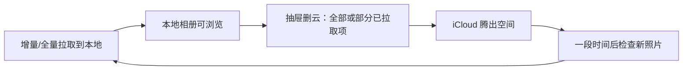
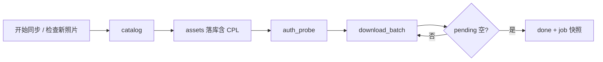
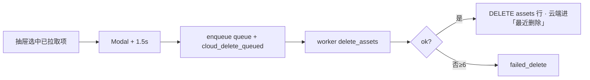
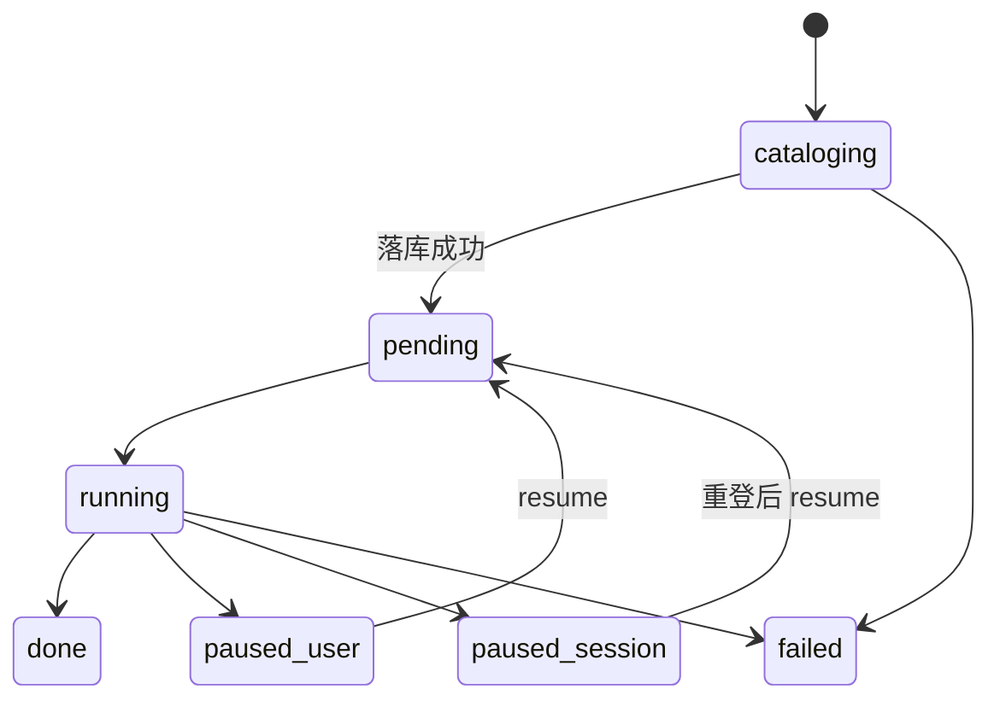

# iCloud 同步 — 下载 / 云态 / 删云

> **产品目的：** iCloud 空间不够 → **单向拉取到本地** → **显式删云腾空间** → 过一段时间再 **增量拉取**，如此往复。  
> **职责：** catalog 落库 → 可续传下载 → 抽屉云管理 → 用户显式删云。  
> **页面：** `index.vue` + `components/IcloudSyncFab.vue` · `IcloudSyncStatusCard` · `useIcloudSyncJob`  
> **实现：** `src-tauri/src/icloud_sync/*` · sidecar `agent.py` / `ipdPhotos.py` · `api/icloudSync.ts`  
> **前置：** Apple ID 已登录（[loginFlow](./loginFlow.md)）  
> **不涉及：** `src-tauri/src/album/*`（相册纯本地）；**不做**双向冲突 / 上传 / 本地改动比对（原 Phase 4 **取消**）。  
> **对齐：** 2026-08-27（单表 `assets` · CPL catalog 落库 · `local_missing` ≤2000 懒算）

姊妹文档：[登录](./loginFlow.md) · [本地扫描](./loadingFlow.md)

> 本文为 iCloud 同步唯一流程/设计文档。改代码以本文硬规则 / 不变量为准。

---

## 核心场景（腾空间循环）



| 原则 | 含义 |
|------|------|
| 单向 | 只「云 → 本地」；不上传、不比对本地是否被改过 |
| 删云为腾空间 | 删云是产品主路径之一，不是附属功能 |
| 显式确认 | 绝不因「已下载」就自动删云；Modal + 1.5s |
| 本地优先保留 | 删云不删本地盘；相册右键只删本地不碰云 |

---

## 一眼看懂

### A. 下载主路径



| 步 | 发生什么 | 用户看到 |
|----|----------|----------|
| 1 | `start_job` → `cataloging`，立刻返回 `jobId` | 「扫描图库…」 |
| 2 | sidecar `catalog` → delta 落库（含 `cpl_asset_*`） | total 可能仍为 0 |
| 3 | `auth_probe`（**不带密码**）→ `running` | done / pending / failed |
| 4 | 组批 → `download_batch`（lookup CDN → 拉流） | 进度推进 |
| 5 | 磁盘已有非空文件 → 补记 done | — |
| 6 | pending 空 → `done`；session 失效 → `paused_session` | 主按钮切换 |

### B. 删云主路径（腾空间）



| 步 | 发生什么 | 用户看到 |
|----|----------|----------|
| 1 | Modal 确认（Live 默认成对 still+mov）；文案说明「最近删除」≈30 天 | 冷却 1.5s |
| 2 | 读库 CPL + **本地 `dest_path` 必须 is_file**；无 CPL / 本地缺失 → reject | 「需先检查新照片」/「本地缺失跳过」 |
| 3 | worker 调 sidecar（只读 queue 快照） | 等待删云；可撤销 pending |
| 4 | 成功 → **删 assets 行**；失败退避；≥6 → `failed_delete` | 列表刷新 |

### 产品边界

| 区域 | 做什么 | 明确不做 |
|------|--------|----------|
| 相册宫格 | 纯本地浏览；右键只删本地 | 不做云删、无云端角标 |
| 同步抽屉 | 云态 / 下载 / **删云腾空间** / 检查新照片 | 不写回 `media.db` |
| 范围外 | — | 上传、冲突保留、`cloud_sv` 本地指纹（原 P4，**不做**） |

---

## 硬规则（改代码勿破）

1. **每个 job catalog 一次**；`resume_job` **不** re-catalog。增量只允许**新** `start_job({ mode:"incremental" })`（FAB「检查新照片」）。
2. 下载循环只用 `auth_probe`，**禁止**带密码 `auth`。
3. **active job** 内 `done + pending + failed = total`（按 **part 行**）；job 结束写 `jobs.*_count` 快照，历史 job 读快照。
4. Live = still + mov 两行同 `index_num`；勿用 `total - done` 推 pending。
5. CDN **410/404 ≠ session** → 单文件 lookup 重试，不暂停整 job。
6. **`assets` 跨 job 唯一** `(apple_id, asset_id, part)`；**禁止** `ON DELETE CASCADE` 到 jobs。
7. **删云元数据 catalog 时落库**；删云只读 `assets` / queue 快照；**禁止** cache / `photos.all` 扫库补齐。
8. 用户删云 → `cloud_delete_queued`；catalog 报删 → `deleted_cloud_pending`；**禁止混用**。
9. **绝不静默自动删云端**（Modal + 1.5s）；云删成功 → **DELETE assets 行**。
10. **`local_missing` 懒算**：候选 SQL `LIMIT ≤2000` + `is_file()`；禁止无上限全表扫盘；**不写回** `cloud_state`。
11. 全局**同时仅一个** download worker（`try_claim_job`）；有 pending 下载时云删让 token。
12. 两库独立：不 reconcile `media.db`。
13. **删云入队前本地必须在盘**（`dest_path` + `is_file`）；否则 reject，禁止「云先没了、本地也没了」。
14. 下载 `done` 主 CTA 引导「删云腾空间」（筛已同步），而非仅「在相册中查看」。

---

## 速查

### 任务状态 `jobs.status`

| status | 含义 | 用户动作 |
|--------|------|----------|
| `cataloging` | 枚举图库 | 等待（不可 pause） |
| `pending` | 已建库，即将下 | — |
| `running` | 批量下载中 | 可暂停 |
| `paused_user` | 手动暂停 | 继续 |
| `paused_session` | 登录失效 | 重登 → 继续 |
| `done` | 全部处理完 | **删云腾空间** / 检查新照片 / 看相册 |
| `failed` | 锁定/限流/catalog 挂 | 新建；勿盲目 resume |



### 云态 `assets.cloud_state`

**持久（写库）**

| 态 | 含义 |
|----|------|
| `cloud_only` | catalog 有、未下载 |
| `synced` | 已下载且 catalog 未报改/删 |
| `modified_cloud` | 云端有新版线索（待重下；同路径覆写，不比对本地改动） |
| `deleted_cloud_pending` | **仅** catalog 报云端已删 |
| `cloud_delete_queued` | **仅**用户删云已入队 |
| `failed_delete` | 云删 ≥6 次仍失败 |

**派生（不写库）**

| 态 | 含义 |
|----|------|
| `local_missing` | `dest_path` 非空但磁盘无文件 |

### 事件 / 命令

| 事件 | 用途 |
|------|------|
| `icloud-sync://progress` | `{ done, total, failed, pending, filename }` |
| `icloud-sync://job-status` | 状态卡 / 角标 |
| `icloud-sync://cloud-state-changed` | 抽屉刷新云列表 / 计数 |

| 命令 | 作用 |
|------|------|
| `icloud_sync_start_job` | catalog + 可选 spawn download（`mode: full \| incremental`） |
| `icloud_sync_resume_job` / `pause_job` | 续传 / 暂停（不 re-catalog） |
| `icloud_sync_load_assets` | 抽屉分页列表（可派生 `local_missing`） |
| `icloud_sync_get_cloud_state_summary` | 计数；`checkDisk` 时懒算 missing |
| `icloud_sync_delete_assets` | 入队删云（腾空间）；拒本地缺失 |
| `icloud_sync_delete_all_synced` | **跨页**已同步全部入队删云 |
| `icloud_sync_cancel_cloud_delete` | 撤 pending |
| retry / clear binding | 失败重试 / 清 `dest_path`→`cloud_only` |

### 落盘命名

```text
{outputDir}/{index:05d}_{stem}.{ext}
Live mov → 强制 .mov；原子写 *.partial → replace
outputDir：settings.outputDir 或 {albumRoot}/iCloudSync
```

**跨 job 稳定路径**：`index_num` 首次 catalog 写入；re-download / modified **覆写同一 `dest_path`**，不重新编号。

### part 对照

| sidecar | Rust / DB |
|---------|-----------|
| `still` | `still` |
| `mov` | `mov` |
| `full` / `video` | `full` |

Live：下载分两行；抽屉删云选 still 默认成对 enqueue mov。

---

## 细节（按需）

### Catalog（仅 `start_job`）

```text
start_job → catalog
  1. apple_id + view + mode
  2. 读 cloud_cursors；sidecar --cursor 或降级 B 全量 diff
  3. cursor_expired → 清 cursor，全量
  4. 每条（unchanged 可跳过下载入队，仍可刷新 cpl_*）：
       upsert 元数据 + last_catalog_at + cpl_asset_*
       added     → cloud_only + download pending
       modified  → modified_cloud + download pending（同 dest_path 覆写；不比对本地改动）
       deleted   → deleted_cloud_pending（保留 dest；不自动删本地）
  5. jobs.total_count = 本 job 新 pending；spawn worker
  6. mark done → dest_path + synced
  7. job 结束 → 清 download_status/active_job_id；写 jobs 快照
```

- 视图：默认 `library`（`capture_at`）；可选 `recents`（`added_at`）。  
- sidecar `items[]` **不**缓存 downloadURL。  
- 每条尽量带 `cpl_asset_record_name` / `cpl_asset_change_tag`。  
- 降级 B：fingerprint = `hash(sort_key+filename+media_kind)`，基线 = `assets` 现有行（全表进内存，仅 catalog 路径）。  
- 「强制全量」→ `mode:"full"`；连续 2 次 incremental 变更 >50% → 清 cursor。

### Download 循环

```text
auth_probe → running
loop:
  pause? → paused_user
  list_pending → 磁盘已有则 done
  组批 ≤ concurrency → sleep ≥400ms
  download_batch（去重 asset lookup，10min TTL cache）
  ok→done / auth→paused_session / fatal→failed job / 其它→failed 行
  sleep 200–800ms
pending 空 → done
```

| CDN | 行为 |
|-----|------|
| 批前 | 本批去重 `asset_id` → `records/lookup`（O(1)，非扫库） |
| 410/404 | invalidate + 强制 lookup **1 次** |
| 刻意不做 | catalog 后全库重扫 URL；用 lookup stub 当 CPL 删云 |

### 暂停 / 续传 / 检查新照片

| 操作 | 要点 |
|------|------|
| pause | 仅 running/pending；cataloging 不可停 |
| resume | reset failed→pending；磁盘 reconcile；**不** re-catalog |
| 检查新照片 | **新** `start_job({ mode:"incremental" })`；与 resume 无关 |
| 换号 | `job.apple_id` 须一致，否则 `account_mismatch` |

### 抽屉 UI（`IcloudSyncFab`）

- **单列表** + **一屏布局**：登录态在 drawer `#extra`；StatusCard 紧凑；summary 计数 **并入筛选 Tab 徽标**（0 不显示）；删云收「删云」下拉；表格 `flex:1` 动态高度。  
- 筛选：`modified_cloud` · `deleted_cloud_pending` · `cloud_delete_queued` · `local_missing` · `failed_delete`。  
- 提示：catalog 已删 / 等待删云 / 本地缺失 → 一键筛选。  
- 文案侧重「拉取 → 删云腾空间」；云端同资产再出现时重下覆写同路径即可。

### 删云（腾空间）

**入队** `icloud_sync_delete_assets` / `icloud_sync_delete_all_synced`：

1. 读 `prev_cloud_state` + `cpl_*`；无 CPL 名 → **reject**（`rejected_missing_cpl`）。  
2. **`dest_path` 非空且 `is_file`**，否则 **reject**（`rejected_local_missing`）——腾空间前保本地。  
3. `INSERT OR IGNORE` queue（快照 CPL）+ `cloud_state=cloud_delete_queued`。  
4. `delete_all_synced`：扫全部 `cloud_state=synced` + Live 成对，再走同一入队门禁。  
5. cancel：仅 `pending`；恢复 `prev_cloud_state`。  
6. Modal 须说明：软删进「最近删除」，约 30 天后才彻底释放空间。

**Sidecar** `delete_assets`（batch ≤50）：

1. 按 `cpl_asset_record_name` 去重（Live 共名只删一次）。  
2. 只读入参/快照；tag 冲突 → 按 recordName **定点 lookup 一次**。  
3. `isDeleted=1`（对齐 icloudpd →「最近删除」）；已不存在 → 幂等 ok。

**Worker：**

```text
pending → deleting → done → DELETE assets + 审计
                 └→ fail → attempts++ <6 退避
                           ≥6 → failed_delete
```

审计：`<album>/audit/cloud_deletes_YYYY-MM.log`（约 90 天）。

### Schema 要点

绿field：**无增量迁移链**。`ensure_schema` 只建终态表；`schema_meta.version≠1` 或缺关键列 → **DROP 重建空库**（开发期不兼容旧 `state.db`）。

```sql
-- jobs：会话 + 结束时计数快照（total/done/failed/pending_count）
-- assets：跨 job 注册表
--   cloud_state / download_status / active_job_id 分离
--   cpl_asset_record_name / cpl_asset_change_tag  （catalog 落库）
-- cloud_cursors：(apple_id, view) → cursor
-- cloud_delete_queue：用户删云；含 prev_cloud_state + cpl 快照
```

写回边界：`load_assets` / summary **只读派生**；写回仅 catalog、下载完成、删云入队/worker、用户 command。

### `output_dir` 与相册 root

| 场景 | 约定 |
|------|------|
| 默认 | `{albumRoot}/iCloudSync` → WalkDir 进宫格 |
| 自定义到相册外 | 仍下载；抽屉可标「不在相册内」 |
| root 变化 | 不自动改 output_dir；`local_missing` 只查 `dest_path` |

---

## 不变量（安全）

1. 绝不静默自动删云端。  
2. 云删与本地删解耦。  
3. Apple ID 隔离（`WHERE apple_id=current`）。  
4. 删云 queue UNIQUE + `INSERT OR IGNORE`。  
5. `deleted_cloud_pending` ≠ `cloud_delete_queued`。  
6. catalog deleted → 不自动删本地。  
7. load_assets 不写回 `cloud_state`。  
8. 下载优先于云删。  
9. 两库独立。  
10. 云删成功 → DELETE assets 行。  
11. 单 active download worker。  
12. 删云身份 catalog 时落库，禁止 cache/扫全库补齐。

---

## 排查

| code / 现象 | 动作 |
|-------------|------|
| `session_expired` | 重登 → resume（非 410） |
| `download_failed` | resume 重试；查 sidecar / diagnostic |
| CDN 410/404 | 单文件 lookup；**不是** session |
| `account_locked` / `rate_limited` | **停**；勿连点 |
| `domain_mismatch` | 设置切 com/cn → logout → 重登 |
| `account_mismatch` | 新建任务 |
| 删云入队 rejected | 缺 CPL →「检查新照片」或全量 |
| `sidecar_crashed` | 重启 `cs:dev` / 应用 |

| 路径 | 内容 |
|------|------|
| `<appData>/icloud-sync/state.db` | jobs + assets + cursors + delete_queue |
| `<appData>/icloud-sync/session/` | session + `auth-diagnostic.json` |
| `{outputDir}/` | `00001_IMG_….heic` 等 |
| keyring | 密码（不进 settings） |

调试：`pnpm run cs:dev` · sidecar `pytest` · `cargo test --lib icloud_sync`

---

## 明确不做（原 Phase 4，已取消）

本产品是 **腾空间循环**，不是双向相册同步。下列能力 **不实现**：

- `cloud_sv_*` / 本地指纹比对  
- `modified_local` / `conflict` / 冲突保留策略  
- `cloud_upload_queue` / 上传  
- `downloadConflictDefault`  

`modified_cloud` 仅表示「云端目录又出现该资产的新版本线索」→ 入队重下覆写；**不**做「本地是否被用户改过」的检测。
