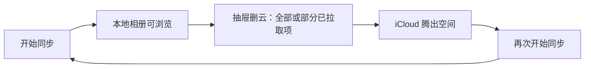
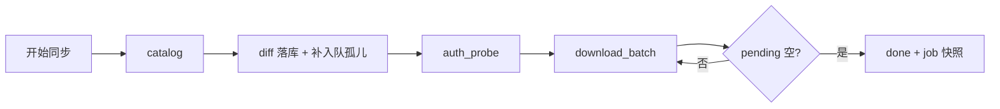
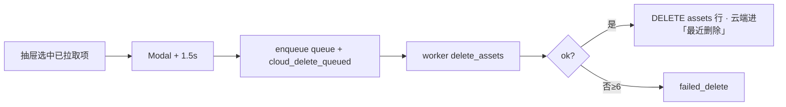

# iCloud 同步 — 下载 / 云态 / 删云

> **产品目的：** iCloud 空间不够 → **单向拉取到本地** → **显式删云腾空间** → 过一段时间再 **开始同步**，如此往复。  
> **职责：** catalog 落库 → 可续传下载 → 抽屉云管理 → 用户显式删云。  
> **页面：** `index.vue` + `IcloudSyncFab.vue` · `IcloudSyncStatusCard` · `useIcloudSyncJob`  
> **实现：** `src-tauri/src/icloud_sync/*` · sidecar `agent.py` / `ipdPhotos.py` · `api/icloudSync.ts`  
> **前置：** Apple ID 已登录（[loginFlow](./loginFlow.md)）  
> **不涉及：** `src-tauri/src/album/*`（相册纯本地）；**不做**双向冲突 / 上传 / 本地改动比对（原 Phase 4 **取消**）。  
> **对齐：** 2026-08-28（单一「开始同步」入口 · full catalog + 孤儿补入队 · 取消任务 · 登出协作暂停）

姊妹文档：[登录](./loginFlow.md) · [本地扫描](./loadingFlow.md)

> 本文为 iCloud 同步唯一流程/设计文档。改代码以本文硬规则 / 不变量为准。

---

## 核心场景（腾空间循环）



| 原则 | 含义 |
|------|------|
| 单向 | 只「云 → 本地」；不上传、不比对本地是否被改过 |
| 单一拉取入口 | **仅「开始同步」**；无「检查新照片」等并行路径 |
| 删云为腾空间 | 删云是产品主路径之一，不是附属功能 |
| 显式确认 | 绝不因「已下载」就自动删云；Modal + 1.5s |
| 本地优先保留 | 删云不删本地盘；相册右键只删本地不碰云 |

---

## 用户操作一览（最终实现）

| 操作 | 何时出现 | 行为 |
|------|----------|------|
| **开始同步** | 空闲 / 上次 `done` | 新 job → catalog → diff → **补入队孤儿** → 下载 |
| **暂停同步** | `running` | 协作暂停 worker → `paused_user` |
| **继续同步** | `paused_user` / 重登后 `paused_session` | resume；**不** re-catalog |
| **取消任务** | 未完成且非 `cataloging` | `discard_job`；已下文件保留；可再「开始同步」 |
| **重新开始** | `failed` / 账号不一致 | discard → 开始同步 |
| **释放 iCloud 空间** | 无未完成任务 | 抽屉下拉删云（与 StatusCard 分离，不重复入口） |
| **退出登录** | 抽屉 / 登录弹窗 | 先 pause 运行中 worker → 清 session；**不 discard** |
| **会话失效** | 下载中 auth 失败 | Rust → `paused_session`；**不 discard**；重登后续传 |
| **换号登录** | 登录弹窗换 Apple ID | discard 旧 job + 清前端 jobId |

**扫描中（`cataloging`）**：不可 pause / 取消；catalog 线程结束后若 job 已被 discard 则自动 abort，不写库。

---

## 一眼看懂

### A. 下载主路径



| 步 | 发生什么 | 用户看到 |
|----|----------|----------|
| 1 | `start_job` → `cataloging`，立刻返回 `jobId` | FAB 云图标呼吸动画 |
| 2 | sidecar `catalog` → diff 落库（含 `cpl_asset_*`） | 「扫描图库…」 |
| 3 | **`enqueue_outstanding_for_full_sync`**：catalog 内仍 `cloud_only`/`modified_cloud` 且无 pending 的行补入队 | total 更新 |
| 4 | `auth_probe` → `running` | 水球进度 % |
| 5 | 组批 → `download_batch` | 进度推进 |
| 6 | pending 空 → `done`；session 失效 → `paused_session` | 主按钮切换 |

### B. 删云主路径（腾空间）



| 步 | 发生什么 | 用户看到 |
|----|----------|----------|
| 1 | Modal 确认（Live 默认成对 still+mov） | 冷却 1.5s |
| 2 | 读库 CPL + **本地 `dest_path` 必须 is_file** | 「需先开始同步」/「本地缺失跳过」 |
| 3 | worker 调 sidecar | 等待删云；可撤销 pending |
| 4 | 成功 → **删 assets 行** | 列表刷新 |

**门禁：** `hasIncompleteJob` 为真时禁用删云 UI 与勾选（与下载 worker 互斥）。

### 产品边界

| 区域 | 做什么 | 明确不做 |
|------|--------|----------|
| 相册宫格 | 纯本地浏览；右键只删本地 | 不做云删、无云端角标 |
| 同步抽屉 | StatusCard 同步控制 + 云列表删云 | 不写回 `media.db` |
| 范围外 | — | 上传、冲突保留、检查新照片/incremental 模式 |

---

## 硬规则（改代码勿破）

1. **每个 job catalog 一次**；`resume_job` **不** re-catalog。再次拉取 → **新** `start_job`（「开始同步」）。
2. catalog 后 **必须** 调用 `enqueue_outstanding_for_full_sync`，避免 discard/unchanged diff 后孤儿 `cloud_only` 无 pending。
3. 下载循环只用 `auth_probe`，**禁止**带密码 `auth`。
4. **active job** 内 `done + pending + failed = total`（按 **part 行**）；job 结束写 `jobs.*_count` 快照。
5. Live = still + mov 两行同 `index_num`。
6. CDN **410/404 ≠ session** → 单文件 lookup 重试。
7. **`assets` 跨 job 唯一** `(apple_id, asset_id, part)`。
8. 用户删云 → `cloud_delete_queued`；catalog 报删 → `deleted_cloud_pending`；**禁止混用**。
9. **绝不静默自动删云端**（Modal + 1.5s）。
10. **`local_missing` 懒算**：候选 SQL `LIMIT ≤2000` + `is_file()`；**不写回** `cloud_state`。
11. 全局**同时仅一个** download worker（`try_claim_job`）。
12. **删云入队前本地必须在盘**；否则 reject。
13. **未完成 job 禁止删云**（前端 `canManageCloudSpace` + 后端 worker 互斥）。
14. **主动退出不 discard**；**换号登录 discard**；**会话失效 paused_session 不 discard**。

---

## 速查

### 任务状态 `jobs.status`

| status | 含义 | 用户动作 |
|--------|------|----------|
| `cataloging` | 枚举图库 | 等待（不可 pause/取消） |
| `pending` | 已建库，即将下 | — |
| `running` | 批量下载中 | 暂停 / 取消 |
| `paused_user` | 手动暂停 | 继续 / 取消 |
| `paused_session` | 登录失效 | 重登 → 继续 / 取消 |
| `done` | 全部处理完 | **开始同步** / **删云腾空间** |
| `failed` | 锁定/限流/catalog 挂 | **重新开始** |

### 云态 `assets.cloud_state`

**持久（写库）**

| 态 | 含义 |
|----|------|
| `cloud_only` | catalog 有、未下载 |
| `synced` | 已下载且 catalog 未报改/删 |
| `modified_cloud` | 云端有新版线索（待重下） |
| `deleted_cloud_pending` | **仅** catalog 报云端已删 |
| `cloud_delete_queued` | **仅**用户删云已入队 |
| `failed_delete` | 云删 ≥6 次仍失败 |

**派生（不写库）**：`local_missing` — `dest_path` 非空但磁盘无文件。

### 命令

| 命令 | 作用 |
|------|------|
| `icloud_sync_start_job` | catalog + diff + 补入队 + spawn download（**仅 full**） |
| `icloud_sync_resume_job` / `pause_job` | 续传 / 暂停 |
| `icloud_sync_discard_job` | 取消/丢弃任务（运行中先请求 pause） |
| `icloud_sync_logout` | 清 sidecar + session（**不**动 job 行） |
| `icloud_sync_load_assets` | 抽屉云列表 |
| `icloud_sync_delete_assets` / `delete_all_synced` | 删云入队 |
| `icloud_sync_cancel_cloud_delete` | 撤 pending 删云 |

### 事件

| 事件 | 用途 |
|------|------|
| `icloud-sync://progress` | FAB 水球 / StatusCard 进度条 |
| `icloud-sync://job-status` | 状态卡 / 后台通知 |
| `icloud-sync://cloud-state-changed` | 抽屉云列表刷新 |

---

## Catalog diff（`start_job` 唯一路径）

```text
start_job → catalog
  1. sidecar 枚举 → fingerprint diff（降级 B）
  2. added     → cloud_only + pending
     modified  → modified_cloud + pending
     unchanged → 仅刷新元数据（含 cpl_*）
     deleted   → deleted_cloud_pending
  3. enqueue_outstanding_for_full_sync：
       catalog 内 cloud_only/modified_cloud 且尚无本 job pending → 补入队
  4. jobs.total_count = 本 job pending 数；spawn worker
```

**为何需要步骤 3：** discard 或 unchanged diff 后，注册表仍可能有 `cloud_only` 但 `download_status=NULL`；无此步会「扫完 0 待下载」。

---

## 前端组件职责

| 组件 | 职责 |
|------|------|
| `IcloudSyncFab` | 右下角 FAB（扫描呼吸 / 下载水球）；抽屉云列表 + 删云 |
| `IcloudSyncStatusCard` | 状态标题、进度条、主/次按钮（开始/暂停/继续/取消） |
| `useIcloudSyncJob` | 共享 job 状态、事件、按钮逻辑、`onLogoutAccount` |
| `IcloudSyncAuthModal` | 登录/2FA；换号 discard；退出走 `onLogoutAccount` |

---

## 排查

| code / 现象 | 动作 |
|-------------|------|
| 扫完 0 待下载但抽屉很多「待下载」 | 应已修复（补入队）；仍出现则查 discard 后是否重新 start |
| `session_expired` | 重登 → 继续 |
| `account_mismatch` | 重新开始 |
| 删云 rejected 缺 CPL | 开始同步刷新 catalog |
| 同步中无法删云 | 预期；等 pause/done/cancel 后再操作 |

调试：`pnpm run cs:dev` · `cargo test --lib icloud_sync`

---

## 明确不做

- 「检查新照片」/ `incremental` 同步模式（已移除 UI 与 API 参数）
- 任务内 per-file 列表 UI（`list_asset_tasks` 命令保留供诊断，前端不再拉取）
- 双向同步 / 上传 / 本地指纹冲突检测
