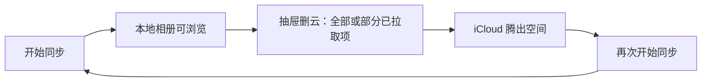
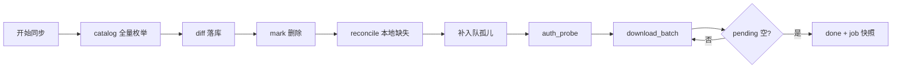
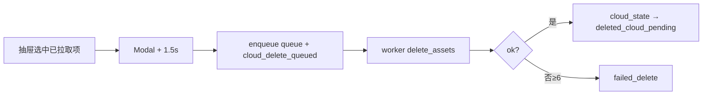

# iCloud 同步 — 下载 / 云态 / 删云

> **产品目的：** iCloud 空间不够 → **单向拉取到本地** → **显式删云腾空间** → 过一段时间再 **开始同步**，如此往复。  
> **职责：** catalog 落库 → 可续传下载 → 抽屉云管理 → 用户显式删云。  
> **页面：** `index.vue` + `IcloudSyncFab.vue` · `IcloudSyncStatusCard` · `useIcloudSyncJob`  
> **实现：** `src-tauri/src/icloud_sync/*` · sidecar `agent.py` / `ipdPhotos.py` · `api/icloudSync.ts`  
> **前置：** Apple ID 已登录（[loginFlow](./loginFlow.md)）  
> **不涉及：** `src-tauri/src/album/*`（相册纯本地）；**不做**双向冲突 / 上传 / 本地改动比对。  
> **对齐：** 2026-09-02（schema v4 产品元数据 · diff 批处理优化 · changeTag 判据 · 全局单任务 · card Tabs）

姊妹文档：[登录](./loginFlow.md) · [本地扫描](./loadingFlow.md)

> 本文为 iCloud 同步唯一流程/设计文档。改代码以本文硬规则 / 不变量为准。

---

## 核心场景（腾空间循环）



| 原则 | 含义 |
|------|------|
| 单向 | 只「云 → 本地」；不上传、不比对本地是否被改过 |
| 单一拉取入口 | **仅「开始同步」**；无「检查新照片」等并行路径 |
| 删云为腾空间 | 删云是产品主路径之一，不是附属功能 |
| 显式确认 | 绝不因「已下载」就自动删云；Modal + 1.5s |
| 本地优先保留 | 删云不删本地盘；相册右键只删本地不碰云 |
| 全局单任务 | 同一 Apple ID **同时仅一个**未完成任务（同步 / 删云 / 刷新目录互斥） |
| 取消不抹统计 | 取消同步/删云任务后，抽屉 cloud summary（如「待同步」计数）**保留**，不随 discard 清零 |

---

## 用户操作一览

| 操作 | 何时出现 | 行为 |
|------|----------|------|
| **开始同步** | 空闲 / 上次 `done` | 新 sync job → catalog → diff → mark 删 → reconcile → 补入队 → 下载 |
| **暂停同步** | `running` | 协作暂停 worker → `paused_user` |
| **继续同步** | `paused_user` / 重登后 `paused_session` | resume；**不** re-catalog |
| **取消任务** | 未完成且非 `cataloging` | `discard_task`；已下文件保留；summary 计数保留 |
| **重新开始** | `failed` / 账号不一致 | discard → 开始同步 |
| **刷新 iCloud 状态** | 无未完成任务 | 仅 catalog diff（`TaskType::Catalog`），不下载 |
| **释放 iCloud 空间** | 无未完成任务 | 抽屉下拉删云 |
| **退出登录** | 抽屉 / 登录弹窗 | 先 pause 运行中 worker → 清 session；**不 discard** |
| **会话失效** | 下载中 auth 失败 | Rust → `paused_session`；**不 discard**；重登后续传 |
| **换号登录** | 登录弹窗换 Apple ID | discard 旧 job + 清前端 jobId |

**扫描中（`cataloging`）**：不可 pause / 取消；catalog 线程结束后若 job 已被 discard 则自动 abort，不写库。

**任务占用提示**：有未完成任务时，云列表操作禁用；文案为「有任务进行中，请取消或等待结束后再操作」（**不**引导「暂停」）。

---

## 一眼看懂

### A. 下载主路径



| 步 | 发生什么 | 用户看到 |
|----|----------|----------|
| 1 | `start_job` → `cataloging`，立刻返回 `jobId` | FAB 云图标呼吸动画 |
| 2 | sidecar `catalog` 全量枚举 → diff 落库（含 `cpl_asset_*` + 产品元数据） | 「扫描图库…」 |
| 3 | **`mark_catalog_deletions`**：库内有、catalog 无 → `deleted_cloud_pending` | — |
| 4 | **`reconcile_synced_missing_local_files_in_catalog`**：本次 catalog 内 `synced` 且 `dest_path` 不在盘 → `cloud_only` | （无单独态，并入「待同步」） |
| 5 | **`enqueue_outstanding_for_full_sync`**：catalog 内仍 `cloud_only` 且无 pending 的行补入队 | total 更新 |
| 6 | `auth_probe` → `running` | 水球进度 % |
| 7 | 组批 → `download_batch` | 进度推进 |
| 8 | pending 空 → `done`；session 失效 → `paused_session` | 主按钮切换 |

### B. 删云主路径（腾空间）



| 步 | 发生什么 | 用户看到 |
|----|----------|----------|
| 1 | Modal 确认（Live 默认成对 still+mov） | 冷却 1.5s |
| 2 | 读库 CPL + **本地 `dest_path` 必须 is_file** | 缺文件则 reject（需先同步或刷新 reconcile） |
| 3 | worker 调 sidecar | 等待删云；可撤销 pending |
| 4 | 成功 → **保留 assets 行**，`cloud_state=deleted_cloud_pending` | Tab「已移除」 |

**门禁：** `canManageCloudSpace` 为假时禁用删云 / 刷新 catalog（与全局单任务互斥）。

### C. 刷新 iCloud 目录

与「开始同步」共用 `persist_catalog_delta`（含 reconcile + 补入队），但 **不 spawn 下载**；job 类型为 `TaskType::Catalog`，完成后即 `done`。

---

## 硬规则（改代码勿破）

1. **每个 sync job catalog 一次**；`resume_job` **不** re-catalog。再次拉取 → **新** `start_job`。
2. catalog 落库顺序：**prepare_catalog_keys_temp → diff（apply）→ mark_catalog_deletions → reconcile（in-catalog）→ enqueue_outstanding**（reconcile 必须在 enqueue 前，否则降级行进不了队列）。
3. catalog 后 **必须** 调用 `enqueue_outstanding_for_full_sync`，避免 discard/unchanged diff 后孤儿 `cloud_only` 无 pending。
4. 下载循环只用 `auth_probe`，**禁止**带密码 `auth`。
5. **active job** 内 `done + pending + failed = total`（**UI / job 快照按逻辑资产**，Live still+mov=1；下载/删云 queue 仍按 part 行）；sync job 结束 `finalize_job_download` 写快照并释放 `download_status`。
6. Live = still + mov 两行同 `index_num`；**UI 一律按一张计**（列表隐藏 mov、Tab 角标 / 进度 / 删云 toast 同口径）。
7. CDN **410/404 ≠ session** → 单文件 lookup 重试。
8. **`assets` 跨 job 唯一** `(apple_id, asset_id, part)`。
9. 用户删云 → `cloud_delete_queued`；catalog 报删 → `deleted_cloud_pending`；**禁止混用**。
10. **绝不静默自动删云端**（Modal + 1.5s）。
11. **本地文件缺失**：不在列表展示单独态；catalog 时 **`reconcile_synced_missing_local_files_in_catalog`**（仅扫本次 catalog 仍存在的 `synced` 行）写回 `cloud_only`（清 `dest_path`）。全库版 `reconcile_synced_missing_local_files` 保留供单测/诊断。
12. 全局**同时仅一个** worker 槽（`try_claim_job`）；`require_no_incomplete_task` 拦截并行 start / 删云 / 刷新。
13. **删云入队前本地必须在盘**；否则 `rejected_local_missing`。
14. **主动退出不 discard**；**换号登录 discard**；**会话失效 paused_session 不 discard**。
15. **`modified_cloud` 已并入 `cloud_only`**（schema v3 迁移）；diff 的 modified 也写 `cloud_only`。
16. 删云成功 **不 DELETE assets 行**，改为 `deleted_cloud_pending` 供列表追溯。
17. **catalog diff 前** 调用 `prepare_catalog_keys_temp`；`mark_catalog_deletions` / `enqueue_outstanding_for_full_sync` / in-catalog reconcile **依赖该临时表**，禁止逐行 N 次 SQL 旧路径。
18. **`assets` 产品元数据**（schema v4）：`capture_at` / `added_at` / `latitude` / `longitude` 随 catalog 落库；**不**落 favorite / album / CPL 全量字段。

---

## 速查

### 任务类型 `jobs.task_type`

| type | 含义 |
|------|------|
| `sync` | 开始同步（catalog + 下载） |
| `cloud_delete` | 从 iCloud 移除（腾空间） |
| `catalog` | 仅刷新 iCloud 目录 |

### 任务状态 `jobs.status`

| status | 含义 | 用户动作 |
|--------|------|----------|
| `cataloging` | 枚举图库 | 等待（不可 pause/取消） |
| `pending` | 已建库，即将下/删 | — |
| `running` | 批量下载或删云中 | 暂停 / 取消 |
| `paused_user` | 手动暂停 | 继续 / 取消 |
| `paused_session` | 登录失效 | 重登 → 继续 / 取消 |
| `done` | 全部处理完 | **开始同步** / **删云** / **刷新** |
| `failed` | 锁定/限流/catalog 挂 | **重新开始** |

### 云态 `assets.cloud_state`（持久）

| 态 | UI 文案 | 含义 |
|----|---------|------|
| `cloud_only` | 待同步 | catalog 有、未下载（含原 `modified_cloud`） |
| `synced` | 已同步 | 已下载且 catalog 未报改/删 |
| `cloud_delete_queued` | 待移除 | 用户删云已入队 |
| `deleted_cloud_pending` | 已移除 | catalog 报删或删云 API 成功 |
| `failed_delete` | 移除失败 | 云删 ≥6 次仍失败 |

**派生（不写库，仅列表展示 / 筛选）**

| 态 | UI 文案 | 条件 |
|----|---------|------|
| `download_failed` | 同步失败 | 活跃 **sync** job 内 `download_status=failed`；任务结束后 finalize 清空，Tab 自动隐藏 |

### 命令

| 命令 | 作用 |
|------|------|
| `icloud_sync_start_job` | sync：catalog + reconcile + diff + 补入队 + 下载 |
| `icloud_sync_refresh_catalog` | catalog only：同上落库路径，不下载 |
| `icloud_sync_active_task` | 当前账号未完成任务状态（sync / 删云 / catalog 统一） |
| `icloud_sync_resume_job` / `pause_job` | 续传 / 暂停 |
| `icloud_sync_discard_job` | 取消/丢弃任务（`discard_task` 按 task_type 分支） |
| `icloud_sync_logout` | 清 sidecar + session（**不**动 job 行） |
| `icloud_sync_load_assets` | 抽屉云列表（支持 cloud_state 筛选） |
| `icloud_sync_get_cloud_state_summary` | Tab 角标计数（逻辑资产；Live=1） |
| `icloud_sync_delete_assets` / `delete_all_synced` | 删云入队 |
| `icloud_sync_cancel_cloud_delete` / `retry_cloud_deletes` | 撤 pending / 重试失败 |

### 事件

| 事件 | 用途 |
|------|------|
| `icloud-sync://progress` | FAB 水球 / StatusCard 进度条（同步与删云共用） |
| `icloud-sync://job-status` | 状态卡 / 后台通知 |
| `icloud-sync://cloud-state-changed` | 抽屉云列表 / summary 刷新 |

---

## Catalog diff（`persist_catalog_delta`）

**策略：降级 B** — sidecar **无** catalog 原生 delta API，每次 **全量枚举** + 本地 fingerprint 比对（**不是** incremental / changeToken 增量）。

```text
sidecar catalog 全量枚举
  → catalog_to_asset_rows（Live = still + mov 两行，共享 index_num）
  → load_existing_baselines
  → classify_catalog_rows
  → prepare_catalog_keys_temp（写入 TEMP 表，供后续批 SQL 复用）
  → apply_catalog_delta
  → mark_catalog_deletions（单条 UPDATE + NOT EXISTS temp）
  → reconcile_synced_missing_local_files_in_catalog（仅 temp 内 synced 行 + is_file）
  → enqueue_outstanding_for_full_sync（单条 UPDATE + EXISTS temp）
  → set_job_catalog_counts → emit cloud-state-changed
```

### Fingerprint（判「变没变」）

```text
fingerprint = sort_key | original_filename | media_kind
```

- `sort_key`：Library = `capture_at`，Recents = `added_at`（**不是** `index_num` 序号）
- diff 粒度：**`(asset_id, part)`**；Live 的 still/mov **分行** classify（列表 UI 合并展示，取更差一侧）

### 分类与写库

| 分类 | 条件 | DB 效果 |
|------|------|---------|
| **Added** | 库内无此行 | INSERT → `cloud_only` + `pending` |
| **Modified** | fingerprint 变 / **`cpl_asset_change_tag` 变** / `deleted_cloud_pending` 恢复 | UPDATE → `cloud_only` + `pending`（重下） |
| **MetadataRefresh** | fp + changeTag 不变，仅产品元数据变（时间/GPS/CPL 名） | UPDATE 元数据；**不改** `cloud_state` / `download_status` |
| **Unchanged** | 全部一致 | **跳过逐行 UPDATE**；批量 `last_catalog_at` |
| **Deleted** | 库内有、catalog 无（`mark_catalog_deletions`） | `deleted_cloud_pending` |

日志示例：

```text
icloud catalog delta job {id}: added=… modified=… meta_refresh=… unchanged=… skipped=… deleted=… enqueued=…
```

`skipped` = Unchanged 且未做逐行 UPDATE 的行数。

### 产品元数据（schema v4，`assets` 表）

| 列 | 来源 | 用途 |
|----|------|------|
| `capture_at` | sidecar `asset_date` | 拍摄时间；按日分组 / 列表「拍摄时间」 |
| `added_at` | sidecar `added_date` | 加入图库时间 |
| `latitude` / `longitude` | CPL `locationLatitude/Longitude`（有 GPS 才写） | 后续地图 / 地区分组 |
| `sort_key` | 仍保留 | catalog 排序；Recents 任务下可能 = `added_at` |

- v3 → v4 迁移只加列；**旧行 NULL**，点「刷新 iCloud 状态」或「开始同步」后补齐。
- **未落库**：favorite、hidden、caption raw、album 成员、CPL 全量 JSON（产品未定不扩）。

### 列表 / 筛选

- `icloud_sync_load_assets` 日期筛选：**优先 `capture_at`**，空则回退 `sort_key`（`substr(..., 1, 10)`）。
- 抽屉「拍摄时间」列：展示 `captureAt ?? sortKey`。
- Live：DB 仍两行；Rust + `icloudSyncCloudList.ts` 合并 still/mov，云态取 **更差** 一侧。

**步骤 reconcile + enqueue 顺序不可颠倒**：先 reconcile 再 enqueue，否则「本地已删文件」进不了本次下载队列。

**enqueue 的意义：** discard 或 unchanged diff 后，注册表仍可能有 `cloud_only` 但 `download_status=NULL`；无此步会「扫完 0 待下载」。

---

## 前端组件职责

| 组件 | 职责 |
|------|------|
| `IcloudSyncFab` | FAB（扫描呼吸 / 下载水球）；抽屉 **card Tabs** 云态筛选 + 列表 + 删云 |
| `IcloudSyncStatusCard` | 状态标题、**单一**进度条（同步/删云按 `taskType` 切换文案）、主/次按钮 |
| `useIcloudSyncJob` | 共享 **单任务** 状态（`icloud_sync_active_task`）、事件、按钮逻辑 |
| `IcloudSyncAuthModal` | 登录/2FA；换号 discard；退出走 `onLogoutAccount` |
| `icloudSyncCloudList.ts` | 状态文案 / Tab 配置 / Live 行合并 / `download_failed` 展示覆盖 |

---

## 排查

| code / 现象 | 动作 |
|-------------|------|
| `task_active` | 取消或等待当前任务后再操作 |
| 扫完 0 待下载但抽屉很多「待同步」 | 查 discard 后是否重新 start；查 reconcile + enqueue 顺序 |
| 本地文件删了仍显示「已同步」 | 点「刷新 iCloud 状态」或「开始同步」触发 reconcile |
| `session_expired` | 重登 → 继续 |
| `account_mismatch` | 重新开始 |
| 删云 rejected 缺 CPL | 开始同步或刷新 catalog |
| 删云 rejected 本地缺失 | 先同步到本地，或 refresh/start 触发 reconcile 后再删 |
| 同步中无法删云/刷新 | 预期；等 pause/done/cancel 后再操作 |
| 移除成功但列表仍有项 | 预期：态为「已移除」，非从列表消失 |

调试：`pnpm run cs:dev` · `cargo test --lib icloud_sync` · 改 `src-tauri` 后 **`cargo check` 须 0 warnings**（见 `.cursor/rules/rust-tauri.mdc`）

---

## 明确不做

- 「检查新照片」/ `incremental` 同步模式 / sidecar **真增量** catalog（无 native delta API）
- diff 层 Live **成对合并判态**（still/mov 分行 classify 即可；列表已合并展示；仅边缘脏数据可能 part 不一致）
- 任务内 per-file 列表 UI（`list_asset_tasks` 保留供诊断）
- 双向同步 / 上传 / 本地指纹冲突检测
- 列表「本地缺失」单独 Tab（已合并进「待同步」+ catalog reconcile）
- `assets` **全量 CPL 元数据**落库（只存产品会用字段，见上表）
