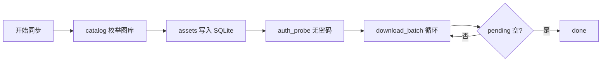
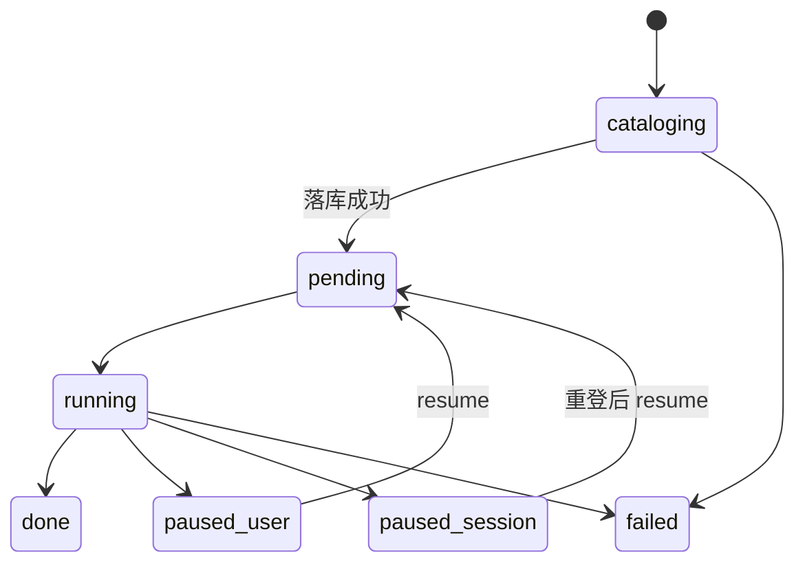

# iCloud 同步 — 文件下载流程

> **职责：** catalog 建库一次 → 可续传批量下载 → 落盘到本地相册目录。  
> **页面：** `icloudSync.vue`  
> **实现：** `icloud_sync/queue.rs` · `naming.rs` · `db.rs` · sidecar `agent.py` / `ipdPhotos.py`  
> **前置：** Apple ID 已登录（见 [loginFlow](../../components/IcloudSyncAuthModal/loginFlow.md)）  
> **对齐：** 2026-08-26

姊妹文档：[登录](../../components/IcloudSyncAuthModal/loginFlow.md) · [本地扫描](./loadingFlow.md)

---

## 一眼看懂



| 步 | 发生什么 | 用户看到 |
|----|----------|----------|
| 1 | `start_job` → `cataloging`，立刻返回 `jobId` | 「扫描图库…」（不阻塞窗口） |
| 2 | sidecar `catalog` → `catalog_to_asset_rows` | progress.total 可能仍为 0 |
| 3 | `auth_probe`（**不带密码**）→ `running` | 概览三数：done / pending / failed |
| 4 | 组批（concurrency 1–3）→ `download_batch`：lookup CDN URL → 并行拉流 | 进度推进；失败进表格 |
| 5 | 磁盘已有非空文件 → 补记 done；批次间抖动降限流 | — |
| 6 | pending 空 → `done`；session 失效 → `paused_session`（等用户重登） | 通知 / 主按钮切换 |

**硬规则（改代码勿破）：**

1. catalog **一次**；resume **不** re-catalog（无 assets 除外）。  
2. 下载循环只用 `auth_probe`，**禁止**带密码 `auth`。  
3. `done + pending + failed = total`（按 **资产行/part**，不是「张数」）。  
4. Live = 两行（still + mov）同 `index_num`；勿用 `total - done` 推 pending。  
5. CDN **410/404 ≠ session 失效** → 单文件 lookup 重试，不暂停整 job。

---

## 速查

### 任务状态

| status | 含义 | 用户动作 |
|--------|------|----------|
| `cataloging` | 枚举图库 | 等待（不可 pause） |
| `pending` | 已建库，即将下 | — |
| `running` | 批量下载中 | 可暂停 |
| `paused_user` | 手动暂停 | 继续 |
| `paused_session` | 登录失效 | 重登 → 继续 |
| `done` | 全部处理完 | 可开新任务 |
| `failed` | 锁定/限流/catalog 挂 | 新建；勿盲目 resume |



### 事件 / 计数

| 事件 | 用途 |
|------|------|
| `icloud-sync://progress` | `{ done, total, failed, pending, filename }` |
| `icloud-sync://job-status` | 状态卡片 / Tab 角标 |

概览三数绑定事件里的 **done / pending / failed**，同源 SQLite 实时统计。

### 落盘命名

```text
{outputDir}/{index:05d}_{stem}.{ext}
Live mov → 强制 .mov；原子写 *.partial → replace
outputDir：settings.outputDir 或 {albumRoot}/iCloudSync
```

---

## 细节（按需）

### Catalog

- 视图：UI 固定 `library`（按 `capture_at`）；可选 `recents`。  
- sidecar 返回 `items[]`（仅索引，**不**缓存 downloadURL）。  
- `photo`→1 行 · `video`→1 行 · `live`→ still+mov 两行共享 index。  
- ~5000 张常需数分钟；此阶段 total 可为 0。

### Download 循环

```text
auth_probe → running
loop:
  pause? → paused_user
  list_pending → 磁盘已有则 done
  组批 ≤ concurrency → sleep ≥400ms
  download_batch（去重 asset lookup，10min cache）
  ok→done / auth→paused_session / fatal→failed job / 其它→failed 行继续
  sleep 200–800ms
pending 空 → done
```

| CDN 刷新 | 行为 |
|----------|------|
| 批前 lookup | 本批去重 `asset_id` → `records/lookup` |
| 410/404 | invalidate + 强制 lookup **1 次**；仍失败 → `download_failed` |
| 刻意不做 | catalog 后全库重扫 URL |

### 暂停 / 续传 / 换号

| 操作 | 要点 |
|------|------|
| pause | 仅 running/pending；cataloging 不可停 |
| resume | reset failed→pending；`reconcile_job_with_disk`；不 re-catalog |
| 换号 | job.apple_id 须一致，否则 `account_mismatch` → 新建任务 |

### 前端 UX（一屏）

状态卡 + 一个主按钮；任务表常显；共享 `useIcloudSyncJob`。

---

## 排查

| code | 动作 |
|------|------|
| `session_expired` | 重登 → resume（非 410） |
| `download_failed` | resume 重试 failed；查 sidecar / diagnostic |
| `account_locked` / `rate_limited` | **停**；勿连点 |
| `domain_mismatch` | 设置切 com/cn → logout → 重登 |
| `account_mismatch` | 新建任务 |
| `sidecar_crashed` | 重启 `cs:dev` / 应用 |

**易混：** 同步中「登录失效」但网页仍正常 → 先看 `auth-diagnostic.json`；若 stage=download* 且 410 → CDN，不是 session。

| 路径 | 内容 |
|------|------|
| `<appData>/icloud-sync/state.db` | jobs + assets |
| `<appData>/icloud-sync/session/` | session + `auth-diagnostic.json` |
| `{outputDir}/` | `00001_IMG_….heic` 等 |
| keyring | 密码（不进 settings） |

调试：`pnpm run cs:dev` · `ICLOUD_SYNC_AGENT_CMD=…` · `pytest`（sidecar）· `cs:sidecar-build`
