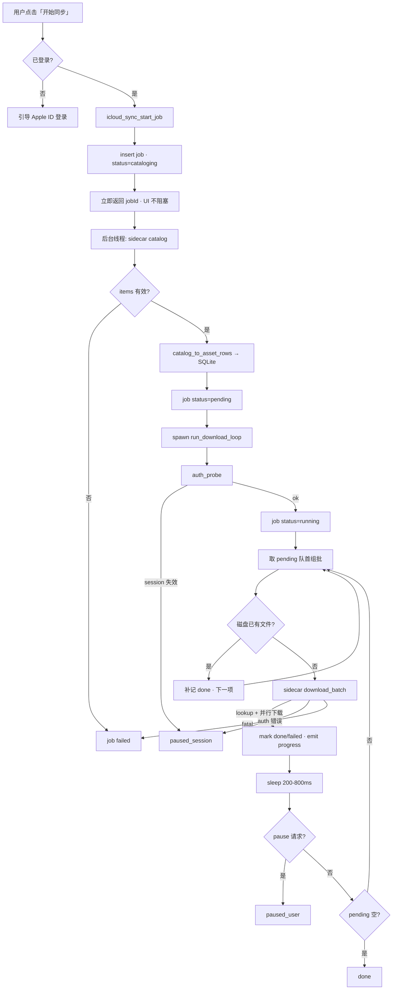
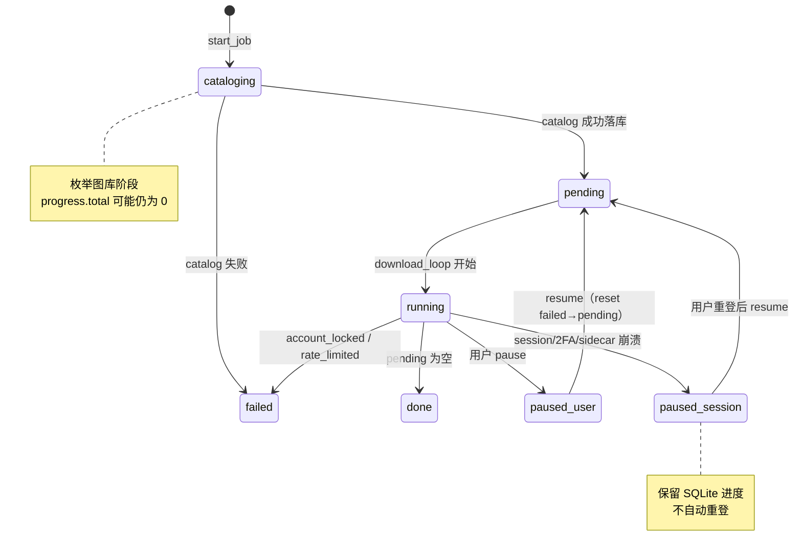

# iCloud 同步 — 文件下载流程

**适用页面：** `icloudSync.vue`（相册 → iCloud 同步）  
**关联实现：** `apps/admin/src-tauri/src/icloud_sync/queue.rs`、`naming.rs`、`db.rs`；`apps/admin/sidecar/icloudSync/agent.py`  
**前置条件：** 已完成 Apple ID 登录（见 [`loginFlow.md`](../../components/IcloudSyncAuthModal/loginFlow.md)）  
**最后对齐：** 2026-08-23

---

## 0. 设计原则

| 优先级 | 原则 | 实现要点 |
|--------|------|----------|
| P0 | **catalog 一次、下载可续** | 首次 `start_job` 全量枚举图库写入 SQLite；`resume` 不 re-catalog（除非任务无 assets） |
| P0 | **下载不携带密码** | 循环前 `auth_probe`（无密码）；session 失效 → `paused_session`，等用户显式重登 |
| P0 | **批量下载 concurrency 1–3** | Rust 按 `settings.concurrency` 组批 → sidecar `download_batch` + ThreadPoolExecutor |
| P1 | **单文件重试** | sidecar `ipdPhotos` 内 HTTP 3 次退避 + 自适应超时；**410/404 自动 invalidate + 强制 lookup 重试 1 次** |
| P1 | **失败可追溯** | SQLite `last_error` / `attempt_count`；同步页失败表格 + `icloud_sync_list_failed_assets` |
| P1 | **降限流风险** | 批次间 ≥400ms + 每批成功后随机 sleep **200–800 ms** |
| P1 | **CDN URL 按需刷新** | catalog **不**建全库 photo_cache；`download_batch` 前对本批去重 `asset_id` 做 `records/lookup`；**10 min** 内同 asset 复用进程内 cache |
| P1 | **断点与磁盘对齐** | 目标文件已存在且非空 → 补记 `done`；resume 时 `reconcile_job_with_disk` |
| P2 | **失败可跳过** | 单文件 `download_failed` 标 `failed` 并继续；`account_locked` / `rate_limited` 整 job `failed` |

### 0.1 进度计数说明（排查「序号不连续」/ 概览数字不对）

- **`done / total` 统计的是资产行（part）**，不是「照片张数」。
- **`total` = done + failed + pending**（三者互斥，同一 job 内恒等）。
- **概览「待下载 / 失败」** 读 `icloud-sync://progress` 与 `job-status` 的 **`pending` / `failed`**（Rust 每次 `emit_progress` 从 SQLite 实时统计）；**勿**用 `total - done` 推算 pending（会重复计入 failed）。
- **Live Photo** 同一 `index_num` 对应两行：`still` + `mov`，落盘两个文件。
- **失败行** 标为 `failed`，`list_pending` 跳过，故输出目录可能出现 `00002.mov`、`00004.mov` 而缺 `00001.jpg`。
- 文件名规则：`{index:05d}_{sanitized_stem}.{ext}`（见 `naming.rs`）；MOV 部件扩展名强制 `.mov`。

---

## 1. 架构分层

```text
┌─────────────────────────────────────────────────────────────┐
│  icloudSync.vue                                               │
│  开始/暂停/续传 · 概览/失败表格 · job-status 事件 · localStorage  │
└───────────────────────────┬─────────────────────────────────┘
                            │ invoke + listen events
┌───────────────────────────▼─────────────────────────────────┐
│  Rust icloud_sync/queue.rs                                    │
│  start_job · resume · pause · job_status                       │
│  spawn_catalog_then_download → run_download_loop（批量 download_batch）│
│  SQLite state.db · 命名 · 进度 emit                            │
└───────────────────────────┬─────────────────────────────────┘
                            │ stdin/stdout line-JSON (protocol=1)
┌───────────────────────────▼─────────────────────────────────┐
│  Python sidecar agent.py + ipdPhotos.py                      │
│  catalog：枚举图库 → items[]（仅索引，不缓存 downloadURL）      │
│  download_batch：本批 records/lookup → 并行拉流 → 原子落盘    │
└───────────────────────────┬─────────────────────────────────┘
                            ▼
                     iCloud Photos API（pyicloud_ipd）
```

**Sidecar 约束：** `SidecarClient` 内部 `Mutex` 保证同一时刻仅一条 in-flight 请求；sidecar 主循环逐行读 stdin、逐行写 stdout。

---

## 2. 总览流程图



---

## 3. 任务状态机



| status | 含义 | 用户动作 |
|--------|------|----------|
| `cataloging` | 后台扫描 iCloud 图库 | 等待；可正常操作窗口 |
| `pending` | 已建库，下载线程即将/正在启动 | — |
| `running` | 批量下载中（1–3 并发） | 可「暂停同步」 |
| `paused_user` | 用户手动暂停 | 「继续同步」 |
| `paused_session` | 登录/session 失效 | 重新登录 → 「继续同步」 |
| `done` | 全部 pending 处理完（含磁盘 reconcile） | 可新建任务 |
| `failed` | 锁定/限流或 catalog 失败 | 新建任务；勿盲目 resume |

---

## 4. Catalog 阶段

### 4.1 触发与视图

- 入口：`icloud_sync_start_job(view)`，当前 UI 固定 **`library`**（按拍摄时间 `capture_at` 排序）。
- 可选视图：`library` | `recents`（按 `added_at`）；二者互斥，由 job 行 `view` 字段记录。

### 4.2 Sidecar 命令

```json
{
  "cmd": "catalog",
  "view": "library",
  "apple_id": "user@example.com",
  "session_dir": "<appData>/icloud-sync/session"
}
```

**成功响应：**

```json
{
  "type": "done",
  "cmd": "catalog",
  "items": [
    {
      "asset_id": "…",
      "filename": "IMG_0027.HEIC",
      "media_kind": "live",
      "live_pair_id": "…",
      "capture_at": "2024-01-01T12:00:00Z",
      "added_at": "2024-01-02T08:00:00Z",
      "parts": ["still", "mov"]
    }
  ]
}
```

### 4.3 媒体类型与 parts

识别逻辑与 icloudpd 一致（见 `ipdPhotos.ipd_media_kind`）：

| 条件 | media_kind | parts |
|------|------------|-------|
| `item_type == MOVIE` | `video` | `["video"]` |
| `IMAGE` 且 versions 含 `LivePhotoVersionSize.ORIGINAL` | `live` | `["still", "mov"]` |
| 其它 `IMAGE` | `photo` | `["still"]` |

| media_kind | parts | SQLite 行数 | 说明 |
|------------|-------|-------------|------|
|------------|-------|-------------|------|
| `photo` | `["still"]` | 1 | 普通照片 |
| `video` | `["video"]` | 1 | 独立视频 |
| `live` | `["still", "mov"]` | 2 | 同 `index_num`，先 still 后 mov |

### 4.4 Rust 落库规则

1. 按视图排序键升序：`library` → `capture_at`，`recents` → `added_at`。
2. 每条 catalog 校验：排序字段非空；`live` 必须有 `live_pair_id`。
3. 顺序分配 `index_num` = 1, 2, 3…（**按 catalog 条目**，Live 两行共享同一 index）。
4. 写入 `assets` 表，初始 `status=pending`。
5. **catalog 结束即返回**；不在此阶段建 `photo_cache` 或预拉 downloadURL（大图库全量缓存成本高且 URL 会过期）。

### 4.5 耗时预期

- 全量 `api.photos.all` 迭代；~5000 张规模通常 **数分钟**。
- 此阶段 `progress.total` 可能为 0；UI 显示「正在扫描 iCloud 图库…」。

---

## 5. Download 阶段

### 5.1 循环逻辑（`run_download_loop`）

```text
1. ensure_sidecar + auth_probe
2. set job → running
3. loop:
     a. 检查 pause 标志 → paused_user
     b. list_pending（ORDER BY index_num, still<mov）
     c. 队首：磁盘已有有效文件 → mark done，continue
     d. 组批：最多 concurrency 行（1–3，来自 settings.concurrency）
     e. sleep ≥400ms（批次间隔）
     f. sidecar download_batch：
          - 本批去重 asset_id → records/lookup（10min 内已 lookup 的跳过）
          - ThreadPoolExecutor 并行拉流落盘
     g. 逐行 apply 结果：ok → done；auth 错 → paused_session；fatal → failed job；其它 → mark failed 继续
     h. sleep 200–800ms（批次成功后抖动）
4. pending 空 → done
```

### 5.2 Sidecar 命令（`download_batch`）

```json
{
  "cmd": "download_batch",
  "items": [
    {
      "row_id": 42,
      "asset_id": "<icloud asset id>",
      "part": "still",
      "dest_path": "E:\\testFiles\\iCloudSync\\00001_IMG_0027.heic"
    }
  ],
  "concurrency": 2,
  "view": "library",
  "apple_id": "user@example.com",
  "session_dir": "<appData>/icloud-sync/session"
}
```

**成功响应（节选）：**

```json
{
  "type": "done",
  "cmd": "download_batch",
  "results": [
    { "row_id": 42, "asset_id": "…", "part": "still", "ok": true }
  ]
}
```

单条 `download` 命令仍保留（**仅测试 / mock**）；生产路径一律 `download_batch`。

**part 映射（Rust → sidecar）：**

| AssetPart | media_kind | sidecar part |
|-----------|------------|--------------|
| Still | Photo / Live | `still` |
| Mov | Live | `mov` |
| Full | Photo | `still` |
| Full | Video | `video` |

### 5.3 CDN URL 刷新（`records/lookup`）

大图库长跑时 iCloud CDN 签名 URL 会过期（HTTP **410/404**）。**这不是 Apple ID session 失效**，不得映射为 `session_expired` 暂停整 job。

| 环节 | 行为 |
|------|------|
| **批次预取** | `download_batch` 开始前 `_ensure_batch_download_assets`：对本批 **去重** `asset_id` 调用 CloudKit `records/lookup`（`ipdPhotos.fetch_photo_assets_by_ids`） |
| **进程内 cache** | lookup 结果写入 `photo_cache`；同 asset **10 min**（`PHOTO_URL_CACHE_TTL_SEC=600`）内复用，不重复 lookup |
| **410/404 兜底** | 单文件下载遇 stale URL → `_invalidate_asset_lookup` + **强制 lookup 重试 1 次**；仍失败标 `download_failed` |
| **刻意不做** | catalog 后全库 `photos.all` 重扫；仅清 `_versions` 而不重拉 master record（社区证实无效） |

对齐参考：[mandarons/icloud-docker #492](https://github.com/mandarons/icloud-docker/issues/492)（CPLMaster 不可 `records/query`，须 `records/lookup`）。

### 5.4 落盘与命名

- **目标路径：** `{output_dir}/{index:05d}_{stem}.{ext}`
- **stem：** iCloud 原文件名去扩展名，经 Windows 非法字符清洗（`naming.rs`）。
- **Live mov：** 扩展名强制 `mov`，与 still 的 heic/jpg 无关。
- **下载 API（2026-08-22 对齐 icloudpd）：** sidecar 经 `ipdPhotos.py` 使用 `photo.versions_with_raw_policy(AS_IS)` + `photo.download(api.photos.session, version.url)`；**不再**使用 picklepete/pyicloud 的 `photo.download()` 无参或 `download_url("original_video")` 手写路径。
- **原子写入：** sidecar 先写 `*.partial`，再 `os.replace`；失败删 partial。
- **超时：** Rust `download_batch` 动态超时 **120s + 每文件 180s，上限 600s**（单条 `download` 测试路径仍为 120s）。

### 5.5 输出目录

优先级：

1. 设置页 `outputDir`（`settings.json`）
2. 默认 `{albumRoot}/iCloudSync`（相册根未配置则 start 报错）

配置入口：相册 → **同步设置**（`settings.vue`）。

---

## 6. 暂停 / 续传 / 换号

### 6.1 暂停（`icloud_sync_pause_job`）

- `running` / `pending`：设置协作式 pause 标志；下载循环在 iteration 边界退出 → `paused_user`。
- `cataloging`：**不可暂停**（需等 catalog 完成或失败）。

### 6.2 续传（`icloud_sync_resume_job`）

- 允许状态：`paused_session` | `paused_user` | `pending` | `running`（后者用于恢复卡住的线程）。
- **`reset_failed_to_pending`**：失败行重新入队。
- **`reconcile_job_with_disk`**：pending 行若磁盘已有文件则补 done；若全部完成直接 → `done`。
- **不 re-catalog**：除非 job 无任何 assets 行（应改用 `start_job`）。

### 6.3 账号一致性

- job 创建时的 `apple_id` 必须与当前 settings 一致；否则 `account_mismatch`，UI 禁止 resume，需新建任务。
- 换号前应先 **logout**（见 loginFlow）。

---

## 7. 前端事件与持久化

### 7.1 Tauri 事件

| 事件 | 常量 | 负载 |
|------|------|------|
| 进度 | `icloud-sync://progress` | `{ done, total, failed, pending, filename }` |
| 任务状态 | `icloud-sync://job-status` | `{ jobId, status, appleId, total, done, failed, pending }` |

**UI 概览：** `icloudSync.vue` 的「已完成 / 待下载 / 失败」分别绑定 `progress.done` / `progress.pending` / `progress.failed`（与 `job-status` 同源统计）。

### 7.2 localStorage

| Key | 用途 |
|-----|------|
| `icloud-sync.activeJobId` | 当前任务 id；页面 mount 时恢复查询 |

### 7.3 后台通知

`useIcloudSyncBackgroundAlert.ts` 在 `done` / `paused_session` / `failed` 时 OS 通知（`paused_user` 不通知）。

---

## 8. SQLite 结构（`state.db`）

路径：`<appData>/icloud-sync/state.db`

**jobs**

| 列 | 说明 |
|----|------|
| id | 自增 jobId |
| view | `library` / `recents` |
| output_dir | 落盘绝对路径 |
| apple_id | 创建任务时的账号 |
| status | 见 §3 |
| created_at | Unix 时间戳 |

**assets**

| 列 | 说明 |
|----|------|
| asset_id | iCloud 资产 ID |
| sort_key | 排序键快照 |
| original_filename | iCloud 原名 |
| media_kind | photo / video / live |
| live_pair_id | Live 绑定 ID |
| index_num | 序号（Live 两行相同） |
| part | still / mov / full |
| status | pending / done / failed |
| dest_path | 完成后绝对路径 |

唯一约束：`(job_id, asset_id, part)`。

**手工排查 SQL 示例：**

```sql
-- 某 job 失败项
SELECT index_num, part, original_filename, status FROM assets
WHERE job_id = ? AND status = 'failed'
ORDER BY index_num;

-- 进度统计
SELECT status, COUNT(*) FROM assets WHERE job_id = ? GROUP BY status;
```

---

## 9. 错误码与排查

| code | 阶段 | 含义 | 建议动作 |
|------|------|------|----------|
| `catalog_sort_missing` | catalog | 缺 capture_at/added_at | 换视图或稍后重试；查 sidecar 日志 |
| `live_bind_missing` | catalog/download | Live 缺绑定字段 | 升级 sidecar；若单张资产问题会 skip failed |
| `session_expired` | download | **WEBAUTH / trustedSession 失效**（401/421 等） | 重登 → resume |
| `auth_failed` | catalog/download | 未 auth 或 probe 失败 | 确认已登录；logout 后重登 |
| `need_2fa` | download | 待 2FA | 打开登录弹窗提交验证码 |
| `download_failed` | download | 单文件 IO/API 失败；**含 CDN 410/404 刷新后仍失败** | 看 sidecar stderr / `auth-diagnostic.json`；resume 会重试 failed |
| `domain_mismatch` | catalog/download | 设置页 iCloud 区域（com/cn）与 Apple ID 实际区域不符 | 相册设置切换区域 → logout → 重登（见 loginFlow §8） |
| `account_locked` | 任意 | 账号锁定 | **停止**；iforgot.apple.com |
| `rate_limited` | 任意 | 限流 | 等待数小时；勿连点同步 |
| `sidecar_crashed` | 任意 | sidecar 无响应/退出 | 重启应用；dev 下重启 `cs:dev` |
| `sidecar_missing` | 启动 | 找不到 agent | 打包环境重装；dev 检查 sidecar 构建 |
| `account_mismatch` | resume | 任务账号 ≠ 当前账号 | 新建同步任务 |

### 9.1 常见问题

**Q：点开始同步后很久 progress 为 0？**  
A：处于 `cataloging`；大图库枚举需数分钟，属正常。若超过 10 分钟无变化，查 sidecar 是否存活（120s 超时会有 `sidecar_crashed`）。

**Q：只有 `.mov` 没有对应 `.heic`？**  
A：Live 的 still 可能 failed 或仍在 pending；查 SQLite failed 行或等下载完成。

**Q：重复下载同一文件？**  
A：检查 `dest_path` 是否与命名规则一致；非空文件应被 `mark_asset_done_if_on_disk` 跳过。

**Q：中文路径乱码/写错目录？**  
A：sidecar 已强制 stdin UTF-8；若仍异常，检查 `ICLOUD_SYNC_AGENT_CMD` 与 Windows 区域设置。

**Q：同步中途误报「登录失效」/ `session_expired` 但网页 iCloud 仍正常？**  
A：先查 `auth-diagnostic.json` 的 `stage` 与 HTTP 细节。若为 **410/404 Gone**，属 **CDN 签名 URL 过期**，应走 lookup 刷新 + 单文件 `download_failed` 重试，**不会**因 410 暂停整 job（2026-08-23 已修复误判）。

**Q：概览「待下载」+「已完成」> 总数，或待下载长时间不变？**  
A：旧版 progress 未带 `pending`/`failed`，UI 曾用 `total - done` 推算。升级后读事件内 `pending`/`failed`；三者应满足 `done + pending + failed = total`。

**Q：改 Rust/agent 后行为未变？**  
A：dev 需重启 `pnpm run cs:dev`；sidecar Python 改动需重启进程；发布版需 `pnpm run cs:sidecar-build`。

---

## 10. 本地路径速查

| 路径 | 内容 |
|------|------|
| `<appData>/icloud-sync/settings.json` | outputDir、appleId、icloudDomain 等 |
| `<appData>/icloud-sync/session/` | pyicloud session（按 Apple ID） |
| `<appData>/icloud-sync/state.db` | jobs + assets 进度 |
| `<appData>/icloud-sync/session/auth-diagnostic.json` | 最近一次认证/同步诊断（登录成功、probe、catalog、下载鉴权失败、登出均覆盖） |
| `{outputDir}/` | 下载结果，如 `00002_IMG_0027.mov` |
| keyring | Apple ID 密码（不经 settings） |

`<appData>` 为 Tauri 应用数据目录（Windows 通常在 `%APPDATA%\<app>`）。

---

## 11. 开发调试

| 操作 | 命令 / 环境变量 |
|------|-----------------|
| 开发启动 | `pnpm run cs:dev` |
| 指定 sidecar | `ICLOUD_SYNC_AGENT_CMD=python apps/admin/sidecar/icloudSync/agent.py` |
| Sidecar 单测 | `cd apps/admin/sidecar/icloudSync && pytest` |
| Rust 检查 | `cd apps/admin/src-tauri && cargo check` |
| 打包 sidecar | `pnpm run cs:sidecar-build` |

**日志：** Rust `log::error!` 带 `icloud sync job {id}`；sidecar 异常写入 stderr（Rust 断开时附带 stderr tail）。

---

## 12. 相关文档

- [Apple ID 登录流程](../../components/IcloudSyncAuthModal/loginFlow.md) — auth / 2FA / session / auth_probe
- [Sidecar README](../../../sidecar/icloudSync/README.md) — 构建、协议版本、依赖

---

## 14. P2 同步页 UX（2026-08-24）

**目标：** 一屏看清状态 + 一个主按钮；明细默认折叠。

| 能力 | 实现 |
|------|------|
| 状态卡片 | `IcloudSyncStatusCard`：告警/标题 + 进度条 + 已完成/待下载/失败三数 |
| 主按钮 | `useIcloudSyncJob.primaryAction`：登录 → 开始 → 暂停/继续 → 完成看相册 / 失败或换号重新开始 |
| 任务表 | `a-collapse` 默认收起；`failed > 0` 自动展开；列精简为序号/部件/文件名/状态/备注 |
| 错误备注 | `formatAssetTaskError()` 映射机读码与 CDN/超时 |
| 空态引导 | Steps：登录 → 设置 → 开始；开始前 `validateIcloudSyncReady()` 校验根目录与落盘 |
| Tab 角标 | `album.vue` 读 `syncTabBadge`：同步中 / 需登录 / 已暂停 / 失败数 |
| 丢弃任务 | `icloud_sync_discard_job` +「开始新同步」处理账号不一致 |
| 设置回流 | `?from=sync` 保存后跳回同步页；并发展示为慢/标准/快 |
| 关键词搜索 | `list_asset_tasks` 支持 `keyword` 文件名子串 |
| 预计剩余 | 下载阶段按已完成速率估算 ETA（`useIcloudSyncJob.etaText`） |
| 打开文件夹 | 完成态或 `outputDir` 只读展示；`openPath` 打开落盘目录 |

**共享状态：** `useIcloudSyncJob`（`@vueuse/core` `createSharedComposable`）供同步页与相册壳复用事件监听。

---

| 能力 | icloudpd 标准 | sidecar 现状 | 说明 |
|------|---------------|--------------|------|
| 认证 / 2FA / session | `PyiCloudService` + `icloudAuth.py` | ✅ 已对齐 | 见 loginFlow.md |
| 图库枚举 | `api.photos.all` | ✅ 已对齐 | **仅 catalog**；download 不再全扫 |
| 媒体分类 | `item_type` + `LivePhotoVersionSize.ORIGINAL in versions` | ✅ 已对齐 | `ipdPhotos.ipd_media_kind` |
| still / video 下载 | `photo.download(session, version.url)` | ✅ 已对齐 | `AssetVersionSize.ORIGINAL` |
| Live mov 下载 | 同上，`LivePhotoVersionSize.ORIGINAL` | ✅ 已对齐 | 不再手写 `resOriginalVidCompl` URL |
| CDN URL 刷新 | 社区 `records/lookup` CPLMaster | ✅ 已对齐 | 按批 lookup + 10min cache + 410 invalidate |
| RAW 策略 | `--align-raw as-is` 默认 | ✅ AS_IS | `versions_with_raw_policy` |
| Recents 视图 | icloudpd 多通过 album / list | ⚠️ 部分对齐 | `_iter_view_assets` 有多级 fallback |
| 断点续传下载 | checksum + `.part` 追加 | ❌ 未实现 | sidecar 单次拉流；大图库弱网可能重下 |
| 下载重试 | icloudpd `constants.WAIT_SECONDS` 循环 | ⚠️ 部分 | HTTP 层 3 次退避 + 410 单次 lookup 重试；整 job 靠 resume reset failed |
| Live mov 文件名 `_HEVC` | `--live-photo-mov-filename-policy suffix` | ❌ 未采用 | Rust 命名 `{index}_{stem}.mov` |
| XMP sidecar / EXIF 时间 | `--xmp-sidecar` / `--set-exif-datetime` | ❌ 未实现 | 产品未要求 |
| 并发下载 | icloudpd 线程池 | ✅ P1 | Rust 组批 1–3 + sidecar ThreadPoolExecutor |

**已删除的误用 API（picklepete/pyicloud 遗留）：** `is_live_photo`、`download_url("original_video")`、`photo.download("original")`、无参 `photo.download()`、catalog 后全库 `photos.all` 刷新 URL、`_has_live_indicator` 启发式分类。
