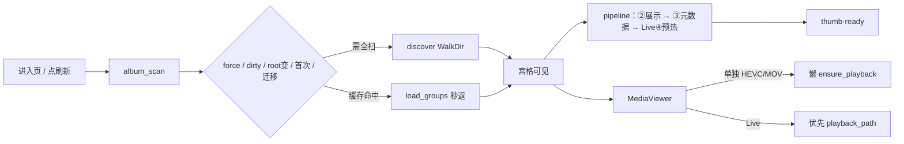

# 本地相册 — 加载与扫描流程

> **职责：** 扫描本地根 → 秒出宫格 → 后台展示资产（缩略图/HEIC 预览/尺寸）→ 元数据补空 → 按类型处理播放代理。  
> **页面：** `index.vue` · `MediaViewer.vue` · `LivePhotoPlayer.vue`  
> **实现：** `src-tauri/src/album/`（mod / scanner / thumbnail / db / media_meta / watcher / ffmpeg …）  
> **前置：** 设置页已配 `rootDir`；HEIC/视频建议捆绑 `ffmpeg` + `ffprobe`  
> **对齐：** 2026-09-05

姊妹文档：[云同步](./cloudSyncFlow.md) · [登录](./loginFlow.md) · [表目录](./schemaCatalog.md)


---

## 落地方案（目标架构 · 单一事实源）

### 四条管线

```text
① 索引 discover     路径 / size / mtime / Live 配对           → 秒出列表（阻塞 invoke）
② 展示 thumb        网格图 + HEIC preview + 尺寸真源         → 不挡首屏
③ 元数据 meta       仅补 capture_at、camera（空才写）         → 紧挨②成功之后
④ 播放 playback     H.264 代理 `_play.mp4`                   → 时机见下表
```

| 对象 | ④ 时机 | 说明 |
|------|--------|------|
| **单独 video** | **懒**：打开 Viewer → `album_ensure_playback` | 长片多；禁止扫描期全量转码 |
| **Live 的 mov** | **预热**：② 中 still 就绪后，同 pipeline 转码 | 短片；悬停就要播 |
| 已有有效 `playback_path` | 跳过 | DB / 磁盘缓存命中 |

Viewer / LivePhotoPlayer：**优先**已有 `playbackPath`；缺失再懒转码兜底。

### 类型矩阵

| 类型 | ② 展示 | ③ 元数据 | ④ 播放 | 宫格画面 |
|------|--------|----------|--------|----------|
| JPG/PNG 等 | 解码→WebP；&lt;100KB 非 HEIC 可复用原图 | sync→EXIF 时间；EXIF 机型 | — | thumb/原图 |
| HEIC/HEIF | 全尺寸解码→WebP + `_full.jpg` | 同上（EXIF 常弱，时间靠 sync） | — | thumb；预览必须 preview |
| **单独视频** | **只抽 1 帧**封面 | 通常无 EXIF | **打开再转**；**分辨率在打开时 ffprobe 落库** | 封面 WebP |
| **Live** | still 同上；**mov 不抽宫格帧** | still 的时间/机型 | **扫描期预热** mov | **still** thumb |

### 尺寸真源（禁止混用）

| 类型 | 时机 | 来源 | 禁止 |
|------|------|------|------|
| 栅格 / HEIC | ② 解码成功 | 解码图宽高 | EXIF 覆盖 |
| 单独视频 | **打开** `ensure_playback` | **`ffprobe` stream 宽高** | 海报帧当正式分辨率；扫描期不写 |
| 非视频兜底 | ② 末轻量探测 | `image_dimensions` | 不覆盖已有值 |

说明：抽首帧 ≠ 整段解码；单独视频分辨率与播放代理同属**懒路径**，扫描只出封面。

### 信息面板

`拍摄时间 · 机型 · 宽×高 · 目录 · 大小 · 序号`（缺项省略）。

| 字段 | 真源 |
|------|------|
| `capture_at` | sync `dest_path` → EXIF DateTime*（仅补空） |
| `camera` | EXIF Make+Model（仅补空） |
| `width`/`height` | 尺寸真源表；③ **不写尺寸** |

### 目标 pipeline

```text
收集：缺 thumb / HEIC 缺 preview / Live 缺 playback
  → 并行②：图 · HEIC · 单独视频抽帧（视频不写海报尺寸）
  → 成功：写路径 + 图/HEIC 尺寸 + emit
  → ③：仅补 capture_at、camera；非视频缺尺寸则 image_dimensions
  → Live④：缺代理则转 mov → playback_path + emit
  → 末尾回填：缺 meta / Live 缺代理
单独视频：打开 ensure_playback 时 ffprobe 写分辨率 + 按需转码
```

### 不做

- 扫描期给全部单独视频预转码或 probe 分辨率  
- Live 宫格用 mov 首帧  
- discover 跑 EXIF / 转码  
- 海报尺寸覆盖 ffprobe  

### 实现切片

| # | 项 | 状态 |
|---|----|------|
| A | 本文方案落盘 | ✅ |
| B | 单独视频分辨率→打开时 ffprobe；EXIF 只补时间+机型；扫描不写海报尺寸 | ✅ |
| C | Live mov 扫描预热；Viewer 优先 playbackPath | ✅ |
| E | 性能：Live 预热限并发+线程帽；缺口早退；meta 限并发；一次 ffprobe；批量写库 | ✅ |


---

## 一眼看懂



| 步 | 发生什么 | 用户看到 |
|----|----------|----------|
| 1 | **decide_path**：force / dirty / root 变 / 首次 / 迁移 → discover；否则 load_groups | — |
| 2a | **discover**：WalkDir → 复用缓存 → Live 配对 → upsert；开始前清零 dirty | 全页 loading |
| 2b | **load_groups** 秒返；不打断在跑 pipeline | 几乎无感 |
| 3 | 返回列表 + watcher（2s debounce→dirty） | **宫格出现** |
| 4 | pipeline：全扫必起；cache_hit 仅旧任务结束时补跑 | 进度条；占位→实图 |
| 5 | ②路径+尺寸 → ③时间/机型 → Live④代理 + emit | 卡片/信息条更新 |
| 5b | 末尾回填缺 meta / Live 缺代理 | 旧库补全 |
| 6 | Viewer；单独视频可能懒转码 | 全屏预览 |
| 6b | 目录树右键打开资源管理器 | 系统文件夹 |
| 6c | 侧栏拖拽改宽 | 列数重算 |

**硬规则（改代码勿破）：**

1. 两阶段：discover 阻塞返回；②③④绝不挡首屏。  
2. IPC **不传 base64**，只传路径 + `convertFileSrc`。  
3. 增量：`path + size + modified`；`fail_count ≥ 3` 跳过。  
4. 新扫描换 **cancel + epoch**；过期 pipeline 禁止写库 / emit。  
5. 取消 ≠ 失败；仅真实失败才 `fail_count++`。  
6. **dirty 在 cancel/wait 前清零**；discover 失败回滚 dirty。  
7. **cache_hit 不 cancel** 进行中的 pipeline。  
8. rootDir 变 → dirty + 清空 last_root → 下次必 discover。  
9. **单独视频懒代理；Live mov 扫描预热**（见落地方案）。


---

## 速查

### UI 阶段

| 阶段 | `phase` | 全页 loading | 宫格 |
|------|---------|--------------|------|
| 未配根目录 | — | 空态 | 无 |
| discover | `discover` | 是 | 否 |
| load_groups 秒返 | `discover` | 几乎无感 | 是 |
| 缩略图/预热中 | `thumbnails`（可再分 live-proxy） | 否 | **是** |
| 完成 | — | 否 | 是 |

### 事件 / 命令

| 事件 | 前端 |
|------|------|
| `album://scan-progress` | 进度条文案 |
| `album://thumb-ready` | `pathIndex` O(1) 写回 thumb/preview/meta/playback |

| 命令 | 作用 |
|------|------|
| `album_scan(root, thumbSize, force?)` | dirty/force → discover 或 load_groups；按需起 pipeline |
| `album_cancel_scan` | 取消 pipeline（离页）；force 全扫由内部 cancel |
| `album_get/save_settings` | `rootDir`；改 root 会强制下次全扫 |
| `album_ensure_playback` | 单独视频（及 Live 兜底）懒转码；**顺带 ffprobe 分辨率落库** |
| `album_delete_local` | 原媒体回收站；缓存永久删；清 media.db；不碰 sync |
| `album_find_local_duplicates` | sync 正本 vs legacy |

### 缓存路径

```text
thumbs/v{ALBUM_CACHE_VERSION}/{hash}.webp       # 网格
thumbs/v{ALBUM_CACHE_VERSION}/{hash}_full.jpg  # 仅 HEIC 预览
thumbs/v{ALBUM_CACHE_VERSION}/{hash}_play.mp4  # 播放代理 → media.playback_path
hash ← stem + modified + size（目录代际在 v{N}）
```

### 刷新 / dirty

| 入口 | force | 路径 |
|------|-------|------|
| mount 且 dirty/首次/root 变 | false | discover（含清孤儿缓存） |
| mount 且干净 | false | load_groups |
| 刷新 / 重试 | **true** | discover |
| watcher 2s | — | 只置 dirty，等下次刷新 |
| 设置改 rootDir | — | dirty + 清空 last_root |

---

## 细节（按需）

### discover

1. 开 `media.db`，`load_indexed_paths`；跳过 `SKIP_DIRS`。  
2. 扩展名 ∈ IMAGE ∪ VIDEO。  
3. 索引命中且缓存在 → 带 thumb/preview/playback/meta。  
4. 小图 &lt;100KB 非 HEIC/视频：thumb 复用原图。  
5. 每目录 `pair_live_photos` → 分组 → 事务 upsert；**陈旧 path 删行后 purge** 对应 thumb/preview/playback（外部删图重载也会清孤儿缓存）。

### pipeline（目标）

1. 跳过 `fail_count ≥ 3`。  
2. 收集缺 thumb / HEIC 缺 preview；**无缺口且 meta/尺寸/Live 代理均齐 → 整段早退**。  
3. 并行②展示；视频抽帧**不写**海报尺寸。  
4. ③ 限并发（约 4）仅补时间/机型；图尺寸批量 `image_dimensions`。  
5. Live④ **最多 2 路并行**预热 `_play.mp4`（单进程 `-threads 2`），批量写 `playback_path`。  
6. 打开单独视频：`ensure_playback` **一次** ffprobe（codec + 分辨率）。  
7. 写副作用前校验 `pipeline_epoch`。

### 清理重复下载

入口：侧栏 **清理重复** → `DuplicateCleanupModal` → `album_find_local_duplicates`。

| 概念 | 规则 |
|------|------|
| 范围 | 相册根**全量**媒体（含 sync 落盘目录） |
| 归组 | 主文件 **BLAKE3** 相同成组（先同 `size` 预筛再算哈希）；**不再**以文件名 stem 为主键 |
| 指纹缓存 | 写 `media.content_hash` + `hash_algo=blake3`；`size`/`modified` 变则清空；弹窗内懒算 |
| 正本 | **落库** → **完整 Live（有 mov）** → 修改时间较新 |
| 一致程度 | **完全一致**（主文件及 Live mov 哈希同）/ **部分一致**（主画面同但 mov 缺或不一致） |
| Live | 同目录成对；归组看 still 哈希，再比 mov |
| 歧义 | 同组多个不同 `asset_id` → `ambiguousStem` |
| UI | 同组**横向滚动**；缩略图 IO root 用横滑容器（非仅纵滚），生成 **限流 2 路** |

删除所选 → `deleteAlbumLocal` → `album_scan(force:true)`。

### Live 配对（同目录）

完整 stem 相等，或 mov stem 去 `_hevc`/`_heic`/`_mov` 后与静帧 stem 相等 → `livephoto`，MOV 剔出列表。  
同步命名：`{unix_secs}_{apple8}_{id16}.{ext}`。

### ffmpeg / ffprobe

| 项 | 说明 |
|----|------|
| 解析 | 捆绑 `resources/ffmpeg.exe` + `ffprobe.exe` → 资源目录 → PATH |
| 开发 | `pnpm run cs:ffmpeg-fetch` |
| HEIC | **不加 `-map`**；超时 60s；回退 WIC |
| 视频首帧 | `-frames:v 1` → tmp.jpg → 封面（**不作**正式分辨率） |
| 视频分辨率 | 打开 `ensure_playback` 时 **一次** ffprobe `codec_name,width,height` |
| 播放代理 | HEVC/MOV → H.264 `_play.mp4`；单独视频懒、**Live 扫描期最多 2 路预热**（防整机内存尖峰） |

### Viewer

| kind | 画面 | 播放 |
|------|------|------|
| image | path；HEIC→previewPath | — |
| video | — | 懒 `ensure_playback` |
| livephoto | still（HEIC→preview） | **优先 playbackPath**；否则懒转码 |

键盘：`Esc` / `←` `→`；范围 = 当前扁平列表。

---

## 排查

| 现象 | 处理 |
|------|------|
| 宫格长期占位 | 看缩略图进度；查 ffmpeg |
| HEIC 空白 | 等 preview；或清缓存重扫 |
| HEIC 只有 512×512 | 清 `thumbs/v*` 重扫 |
| 视频分辨率不准 | 确认已走 ffprobe，非海报尺寸 |
| Live 悬停仍转圈 | 查扫描期是否已写 playback_path；ffmpeg |
| 文件数不对 / 改文件不更新 | force 刷新 |
| db 与缓存不一致 | 同时删 `thumbs/` + `media.db` |

```powershell
Remove-Item -Recurse -Force "$env:APPDATA\com.ll.admin\album\thumbs"
Remove-Item -Force "$env:APPDATA\com.ll.admin\album\media.db" -ErrorAction SilentlyContinue
```

| 路径 | 内容 |
|------|------|
| `<appData>/album/settings.json` | rootDir |
| `<appData>/album/media.db` | 索引 + meta + fail_count |
| `<appData>/album/thumbs/v{N}/` | WebP + HEIC full + play 代理 |
| `{rootDir}/` | 用户相册根 |

调试：`pnpm run cs:dev` · `cargo test album::` · `cargo check`
