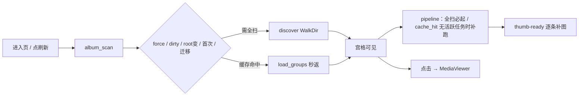

# 本地相册 — 加载与扫描流程

> **职责：** 扫描本地根目录 → 秒出宫格 → 后台补缩略图 / HEIC 预览。  
> **页面：** `index.vue` · `MediaViewer.vue` · `LivePhotoPlayer.vue`  
> **实现：** `src-tauri/src/album/`（mod / scanner / thumbnail / db / watcher / ffmpeg …）  
> **前置：** 设置页已配 `rootDir`；HEIC 建议有捆绑 `ffmpeg`  
> **对齐：** 2026-08-27

姊妹文档：[云同步](./cloudSyncFlow.md) · [登录](./loginFlow.md)


---

## 一眼看懂



| 步 | 发生什么 | 用户看到 |
|----|----------|----------|
| 1 | **decide_path**：force 或 dirty 或 root 变 或 首次 或 迁移 → discover；否则 load_groups 秒返 | — |
| 2a | **discover**：WalkDir → SQLite 复用缓存 → Live 配对 → 批量 upsert；**开始前清零 dirty**（中途变动留给下次刷新） | 全页 loading |
| 2b | **load_groups**：从 SQLite 读分组列表，秒返；**不打断**进行中的 pipeline | loading 几乎无感 |
| 3 | 返回 `MediaGroup[]`，启动 watcher（trailing 2s debounce → 置 dirty） | **宫格出现**（虚拟滚动） |
| 4 | **pipeline**：全扫必起；cache_hit 仅当旧任务已结束/无任务时补跑缺图 | 顶部进度条；占位 → 实图 |
| 5 | 每条成功：`update_cache_paths` + `album://thumb-ready` | 对应卡片刷新 |
| 6 | 点击卡片 → Viewer（图 / 视频 / Live） | 全屏预览 |

**硬规则（改代码勿破）：**

1. 两阶段：discover 阻塞 invoke；缩略图绝不挡首屏。  
2. IPC **不传 base64**，只传路径 + `convertFileSrc`。  
3. 增量索引：`path + size + modified`；失败计数 ≥3 跳过坏文件。  
4. 新扫描换 **新 cancel token + epoch**；过期 pipeline 禁止写库 / emit。  
5. 取消 ≠ 失败；仅真实解码失败才 `fail_count++`。  
6. **dirty 在 cancel/wait 之前清零**，wait 与 WalkDir 期间 watcher 置真不被抹；discover 失败回滚 dirty。  
7. **cache_hit 不 cancel 进行中的 pipeline**；仅 None/已结束时补跑缺图。  
8. rootDir 变化 → dirty=true + last_root 清空 + 下次必走 discover。

---

## 速查

### UI 阶段

| 阶段 | `phase` | 全页 loading | 宫格 |
|------|---------|--------------|------|
| 未配根目录 | — | 空态 | 无 |
| discover | `discover` | 是 | 否 |
| load_groups 秒返 | `discover` | 几乎无感 | 是 |
| 缩略图中 | `thumbnails` | 否 | **是** |
| 完成 | — | 否 | 是 |

### 事件 / 命令

| 事件 | 前端 |
|------|------|
| `album://scan-progress` | 进度条文案 |
| `album://thumb-ready` | `pathIndex` O(1) 写回 thumb/preview |

| 命令 | 作用 |
|------|------|
| `album_scan(root, thumbSize, force?)` | dirty/force 决策 → discover 或 load_groups；按需起 pipeline |
| `album_cancel_scan` | 取消缩略图 pipeline（离页时调用；force 全扫由 album_scan 内部 cancel） |
| `album_get/save_settings` | `rootDir` 等；改 rootDir 会 dirty=true 强制下次全扫 |
| `album_delete_local` | 原媒体（主文件+Live mov）→ 系统回收站；thumb/preview/playback → 永久删；清 media.db；不碰 sync 注册表 |
| `album_find_local_duplicates` | sync 正本 vs legacy 重复组（见「清理重复下载」） |

### 缓存路径

```text
thumbs/v{ALBUM_CACHE_VERSION}/{hash}.webp          # 网格（hash=stem+modified+size，不含目录代际）
thumbs/v{ALBUM_CACHE_VERSION}/{hash}_full.jpg     # 仅 HEIC
thumbs/v{ALBUM_CACHE_VERSION}/{hash}_play.mp4     # HEVC 播放代理（写入 media.playback_path）
hash ← version + file_stem + modified + size
```

### 刷新 / dirty 决策矩阵

| 入口 | force | dirty 状态 | root 变？ | 路径 |
|------|-------|-----------|-----------|------|
| 进入页 mount | false | 初始 true / 或有变动 | —（首次首次算变）| discover |
| 进入页 mount | false | false（看过一次后） | 否 | load_groups 秒返 |
| 刷新按钮 | **true** | 任意 | 任意 | **discover** |
| 重试按钮 | **true** | 任意 | 任意 | **discover** |
| watcher debounce 2s 后 | — | → true | — | 等待用户下次刷新；自动触发取消 |
| 设置改 rootDir | — | → true + last_root 清空 | 是（下次检测到） | 下次进入页必 discover |

---

## 细节（按需）

### discover

1. 开 `media.db`，`load_indexed_paths`；跳过 `SKIP_DIRS`。  
2. 扩展名 ∈ `IMAGE_EXTS` ∪ `VIDEO_EXTS`。  
3. 索引命中且缓存文件在 → 带上 `thumbPath` / `previewPath`。  
4. **小图（<100KB 非 HEIC/视频）thumbPath 直接复用原图**，跳过生成。  
5. 每目录 `pair_live_photos` → 分组 → `delete_stale_paths` + **事务批量 upsert**（WAL）。

### pipeline

1. 跳过 `fail_count ≥ FAIL_THRESHOLD(3)`（真损坏，含 ffmpeg 不可用时期）。  
2. 收集：无 thumb，或 HEIC 无 preview。  
3. 2–8 路并行 `generate_thumbnail`：图 / HEIC（ffmpeg→WIC）/ 视频首帧。  
4. **thumb 或 preview 任一成功** 即落库 + emit；`cancelled` 不计失败。  
5. 写副作用前校验 `pipeline_epoch == my_epoch`。

### 清理重复下载

入口：侧栏 **清理重复** → `DuplicateCleanupModal.vue` → `album_find_local_duplicates`。

| 概念 | 规则 |
|------|------|
| 结构 | 一正本 + 多副本分组；副本带置信度 |
| 置信度 | **低**：stem 同、大小不一致（默认不选）→ **中**：大小一致 → **高**：在中档上内容哈希一致（中/高默认选） |
| 性能 | 仅中档候选读盘算哈希；低档不算哈希 |
| 正本 | `state.db` synced + 新命名 `dest_path` 在盘 |
| Legacy | sync 外 icloudpd + sync 内旧命名；匹配 stem |
| stem 歧义 | 多正本同 stem 时组标 `ambiguousStem` |
| Live | still+mov 分别比大小/哈希；缺 part 标 incomplete |
| 缺 part | 不阻塞匹配；UI 标「旧下载缺配对视频」等 |

删除所选 → `deleteAlbumLocal`（legacy 路径）→ `album_scan(force:true)` 刷新宫格。

### Live 配对（同目录）

任一命中即 `kind=livephoto`，MOV 从列表剔除：

- stem 相同，或去掉 `_hevc` / `_heic` / `_mov` 后相同  
- iCloud 五位序号前缀相同（如 `00003_`）

未配对 MOV 仍为 `video`。

### HEIC / ffmpeg

| 项 | 说明 |
|----|------|
| 解析 | 捆绑 `resources/ffmpeg.exe` → 资源目录 → PATH |
| 开发 | `pnpm run cs:ffmpeg-fetch` |
| 解码 | **不加 `-map`**（否则 512 瓦片）；超时 60s |
| 回退 | `heic_decode`（WIC）；Viewer 用 `previewPath`，不能直接渲 HEIC |
| 视频首帧 | ffmpeg `-frames:v 1 -f image2 -c:v mjpeg -q:v 3` 抽 tmp.jpg → `image::open` 解码 |

### Viewer

| kind | 源 |
|------|----|
| image | `path`；HEIC → `previewPath` |
| video | `<video>` |
| livephoto | `LivePhotoPlayer`（静帧 + MOV） |

键盘：`Esc` / `←` `→`；范围 = 当前目录扁平列表。

---

## 排查

| 现象 | 处理 |
|------|------|
| 宫格长期占位 | 看缩略图进度；查 ffmpeg |
| HEIC 空白 | 等 preview；或清缓存重扫 |
| HEIC 只有 512×512 | 清 `thumbs/v*` 重扫 |
| 文件数不对 | 点刷新按钮 force 重扫；查扩展名白名单 |
| 改文件不更新 | 点刷新按钮 force 重扫（watcher 只置 dirty，不自动扫） |
| 切 rootDir 显示空列表 | 必强制 discover；检查 album_save_settings 是否已触发 dirty |
| db 与缓存不一致 | 同时删 `thumbs/` + `media.db` |

```powershell
Remove-Item -Recurse -Force "$env:APPDATA\com.ll.admin\album\thumbs"
Remove-Item -Force "$env:APPDATA\com.ll.admin\album\media.db" -ErrorAction SilentlyContinue
```

| 路径 | 内容 |
|------|------|
| `<appData>/album/settings.json` | rootDir |
| `<appData>/album/media.db` | 索引 + fail_count |
| `<appData>/album/thumbs/v{ALBUM_CACHE_VERSION}/` | WebP + HEIC full |
| `{rootDir}/` | 用户相册根 |

调试：`pnpm run cs:dev` · `cargo test album::` · `cargo check`
