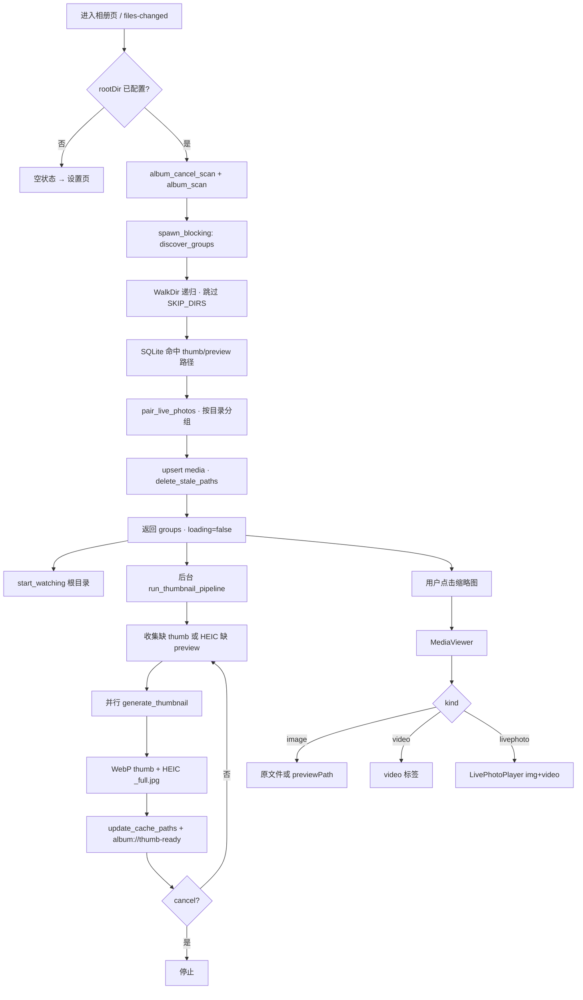
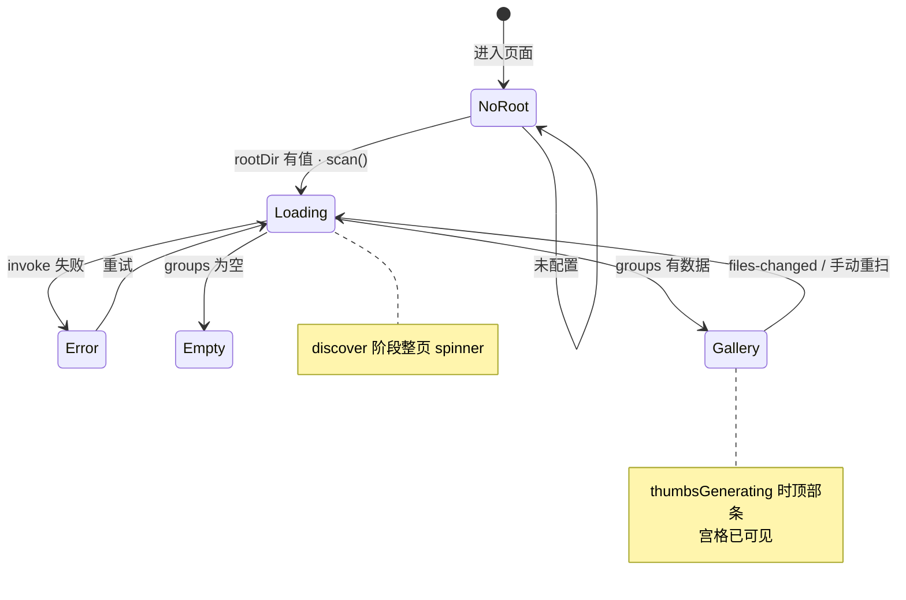

# 本地相册 — 加载与扫描流程

**适用页面：** `index.vue`（相册 → 相册）、`MediaViewer.vue`、`LivePhotoPlayer.vue`  
**关联实现：** `apps/admin/src-tauri/src/album/{mod,scanner,thumbnail,db,watcher,ffmpeg,heic_decode,preview}.rs`  
**前置条件：** 已在 `settings.vue` 配置相册根目录；HEIC 解码需捆绑或本机 `ffmpeg`（见 §11）  
**最后对齐：** 2026-08-23

---

## 0. 设计原则

| 优先级 | 原则 | 实现要点 |
|--------|------|----------|
| P0 | **两阶段扫描、首屏不阻塞** | `discover` 同步返回 `MediaGroup[]`；缩略图/HEIC 预览在后台 `run_thumbnail_pipeline` |
| P0 | **IPC 不传 base64** | 网格用 `thumbPath` + `convertFileSrc`；禁止在 scan 结果内嵌图片数据 |
| P0 | **增量索引** | SQLite `media.db` 按 `path + size + modified` 复用缓存路径；扫描结束 `delete_stale_paths` |
| P1 | **网格 WebP + HEIC 扫描期预览** | 缩略图 `{hash}.webp`；HEIC 同次解码写 `{hash}_full.jpg`，打开查看器无需再生成 |
| P1 | **实况配对** | 同目录 HEIC/JPG + MOV 按 stem / iCloud 序号前缀配对 → `kind=livephoto`，MOV 从列表剔除 |
| P1 | **目录变更自动重扫** | `notify` 监听根目录，2s debounce → `album://files-changed` → 前端 `scan()` |
| P2 | **可取消后台缩略图** | 新扫描 / 离开页 / `album_cancel_scan` 取消进行中的 pipeline |

### 0.1 UI 阶段与进度条

| 阶段 | `phase` | 全页 loading | 顶部进度条 | 宫格可见 |
|------|---------|--------------|------------|----------|
| 未配置根目录 | — | 空状态引导设置 | 无 | 无 |
| 发现文件 | `discover` | **是**（阻塞整页） | 扫描文件 N（total 可能为 0 时 indeterminate） | 否 |
| 发现完成、缩略图进行中 | `thumbnails` | **否** | 生成缩略图 done/total | **是**（已有 thumb 先显示，缺 thumb 显示占位） |
| 缩略图完成 | — | 否 | 隐藏 | 是 |

**注意：** `discover` 阶段 `total` 在遍历中途常为 `0`（未知总量），仅结束时 `done === total`；`thumbnails` 阶段 `total` 为待生成条数（缺 thumb 或 HEIC 缺 preview）。

---

## 1. 架构分层

```text
┌─────────────────────────────────────────────────────────────┐
│  index.vue · MediaViewer.vue · LivePhotoPlayer.vue          │
│  目录树筛选 · 5×158 宫格 · convertFileSrc · 事件监听          │
└───────────────────────────┬─────────────────────────────────┘
                            │ invoke + listen events
┌───────────────────────────▼─────────────────────────────────┐
│  Rust album/mod.rs                                            │
│  album_scan · album_cancel_scan · album_get/save_settings     │
│  album_ensure_preview（兜底，正常路径扫描期已生成 preview）    │
└───────────────────────────┬─────────────────────────────────┘
                            │
        ┌───────────────────┼───────────────────┐
        ▼                   ▼                   ▼
┌───────────────┐  ┌────────────────┐  ┌──────────────────┐
│ scanner.rs    │  │ thumbnail.rs   │  │ db.rs            │
│ discover      │  │ WebP thumb       │  │ media.db 索引    │
│ live 配对     │  │ HEIC full.jpg    │  │ upsert / stale   │
│ 事件 emit     │  │ 并行 batch       │  │                  │
└───────┬───────┘  └────────┬───────┘  └──────────────────┘
        │                   │
        ▼                   ▼
┌───────────────┐  ┌────────────────┐
│ watcher.rs    │  │ ffmpeg.rs      │
│ notify 2s     │  │ HEIC 全尺寸解码  │
│ debounce      │  │ 视频首帧 poster  │
└───────────────┘  └────────────────┘
                            ▼
              本地磁盘（根目录媒体 + appData 缓存）
```

---

## 2. 总览流程图



---

## 3. 扫描两阶段详解

### 3.1 第一阶段 `discover`（同步，阻塞 invoke）

1. 打开 `%appData%/album/media.db`，`load_indexed_paths(root)`。
2. `WalkDir::new(root).min_depth(1)` 递归；目录名在 `SKIP_DIRS` 内则跳过（`.git`、`node_modules` 等）。
3. 扩展名过滤：`IMAGE_EXTS` + `VIDEO_EXTS`。
4. 每条文件：
   - 若索引中 `size`、`modified` 一致且缓存文件仍存在 → 带上 `thumbPath` / `previewPath`。
   - 否则路径字段为 `None`，留给第二阶段。
5. 每目录内 `pair_live_photos` 后按文件名排序。
6. 构建 `MediaGroup`：`relPath` 根目录为 `"."`，`dirName` 为根文件夹名。
7. `delete_stale_paths` + 全量 `upsert_media`。
8. 事件：`album://scan-progress` `phase=discover`。

### 3.2 第二阶段 `thumbnails`（后台线程，不阻塞 invoke）

1. 遍历本次 `groups`，收集：
   - `thumb_path.is_none()`，或
   - HEIC/HEIF 且 `preview_path.is_none()`。
2. `generate_thumbnails_batch_with_progress`：线程池 2–8 路并行。
3. 单文件 `generate_thumbnail`：
   - **图片**：`image::open` 或 HEIC → `ffmpeg` / `heic_decode`。
   - **视频**：`ffmpeg extract_video_poster` 取首帧。
   - 缩略图：`thumbnail(target, target)` → **WebP**（`target = max(size*2, 256)`）。
   - **HEIC**：同次解码另存 `{hash}_full.jpg` 全尺寸预览。
4. 每条完成：`db::update_cache_paths` + `album://thumb-ready`。
5. 进度：`album://scan-progress` `phase=thumbnails`，`done/total`。

### 3.3 缓存键

```text
hash = SHA-like DefaultHasher(ALBUM_CACHE_VERSION + path + modified + size)
thumb  = thumbs/v{version}/{hash}.webp
preview= thumbs/v{version}/{hash}_full.jpg   # 仅 HEIC/HEIF
```

`ALBUM_CACHE_VERSION` 变更（当前 **3**）时需清空 `thumbs/` 与建议重建 `media.db`。

---

## 4. 前端状态机（index.vue）



**目录树：** 平铺各 `MediaGroup`（无「全部」父节点）；默认选中 `relPath === "."` 的根目录分组；切换目录仅筛选当前宫格与查看器范围。

---

## 5. Tauri 事件

| 事件 | 负载 | 触发时机 | 前端处理 |
|------|------|----------|----------|
| `album://scan-progress` | `{ phase, done, total }` | discover 每 20 条 / 结束；thumbnails 每条 | 更新 `scanProgress`、进度条文案 |
| `album://thumb-ready` | `{ path, thumbPath?, previewPath? }` | 单条缓存生成完成 | `applyThumbReady` 更新对应 file |
| `album://files-changed` | 无 | 根目录文件变更（debounce 2s） | `scan()` 全量重扫 |

---

## 6. invoke 命令

| 命令 | 说明 |
|------|------|
| `album_get_settings` | 读 `settings.json`（`rootDir`、`thumbSize`） |
| `album_save_settings` | 写设置 |
| `album_scan` | `{ root, thumbSize }` → `MediaGroup[]`；后台缩略图 |
| `album_cancel_scan` | 取消缩略图 pipeline；新 scan 前也会调用 |
| `album_ensure_preview` | HEIC 按需生成 preview（**兜底**；正常应在扫描期完成） |

---

## 7. 实况照片配对规则

同目录内，对每个 `kind=image` 文件：

1. 收集同组 `.mov` 候选（stem、iCloud 五位序号前缀 `00001_`）。
2. 匹配条件（任一）：
   - MOV stem 与图片 stem 相同；
   - MOV stem 去掉 `_hevc` / `_heic` / `_mov` 后缀后与图片 stem 相同；
   - 双方 iCloud 序号前缀相同（`00001`）。
3. 命中 → `kind=livephoto`，`videoPath=mov.path`；已配对 MOV 从列表 `retain` 移除。
4. 未配对的 MOV 仍以 `kind=video` 单独展示。

**预览：** `LivePhotoPlayer` 静态帧用 `previewPath`（HEIC）或原图；悬停/按住播放 `videoPath` MOV。

---

## 8. HEIC / FFmpeg

| 场景 | 路径 |
|------|------|
| 捆绑 ffmpeg | 打包资源 `resources/ffmpeg.exe`（`tauri.conf.json`） |
| 开发拉取 | `pnpm run cs:ffmpeg-fetch` → 复制到 `src-tauri/resources/` |
| 解析顺序 | 捆绑路径 → 应用资源目录 → PATH 中的 `ffmpeg` |
| 解码要点 | **不加 `-map`**，默认拼合 HEIC 瓦片全图（避免 512×512 单块） |
| 无 ffmpeg | 回退 `heic_decode`（WIC 等）；大图库 HEIC 可能失败或低质量 |

`ffprobe.exe` 与 zip **不进 Git**；见 `src-tauri/.gitignore`、`scripts/ffmpeg-fetch.ps1`。

---

## 9. 查看器加载（MediaViewer）

| `kind` | 数据源 | 说明 |
|--------|--------|------|
| `image` | `path` 或 HEIC 的 `previewPath` | WebView 不能直接渲染 HEIC |
| `video` | `path` | `<video controls>` |
| `livephoto` | `LivePhotoPlayer` | `photoPath` + `videoPath` + `photoPreviewPath` |

键盘：`Escape` 关闭，`←` / `→` 切换。导航范围 = 当前目录筛选后的 `displayGroups` 扁平列表。

---

## 10. 故障与排查

| 现象 | 可能原因 | 处理 |
|------|----------|------|
| 宫格长期灰色占位 | thumb 未生成完或失败 | 看顶部「生成缩略图」进度；查 ffmpeg 是否可用 |
| HEIC 打开空白 | 无 `previewPath` 且扫描未完成 | 等 pipeline；或清缓存重扫 |
| HEIC 预览只有 512×512 | 旧缓存或错误 `-map` 解码 | 升版本清 `thumbs/v*` 重扫 |
| 扫描后文件数不对 | 扩展名不在白名单 | 查 `IMAGE_EXTS` / `VIDEO_EXTS` |
| 修改文件后列表不更新 | watcher 未触发 | 确认变更在根目录子树内；等 2s debounce |
| 重复全页 loading | `files-changed` 触发 `scan()` | 预期行为；大图库可考虑后续做增量 discover |
| `media.db` 与缓存不一致 | 手动删缓存未删 db | 同时删 `thumbs/` 与 `media.db` |

### 10.1 常见问题

**Q：为什么先进 loading 很久才看到宫格？**  
A：`discover` 在 `invoke` 内同步完成，大图库遍历耗时会阻塞整页。缩略图阶段不阻塞，有列表即可见宫格。

**Q：缩略图模糊？**  
A：网格故意用较小 WebP（`max(thumbSize*2, 256)`）；全屏预览用原图或 `_full.jpg`。

**Q：清缓存命令？**  
```powershell
Remove-Item -Recurse -Force "$env:APPDATA\com.ll.admin\album\thumbs"
Remove-Item -Force "$env:APPDATA\com.ll.admin\album\media.db" -ErrorAction SilentlyContinue
```

**Q：改 Rust 后行为未变？**  
A：重启 `pnpm run cs:dev`；Tauri 会重编译；ffmpeg 资源变更需重新 `cs:ffmpeg-fetch` 或 `cs:build`。

---

## 11. 本地路径速查

| 路径 | 内容 |
|------|------|
| `<appData>/album/settings.json` | `rootDir`、`thumbSize` |
| `<appData>/album/media.db` | 媒体索引与缓存路径 |
| `<appData>/album/thumbs/v3/` | WebP 缩略图 + HEIC `_full.jpg` |
| `{rootDir}/` | 用户配置的相册根目录（iCloud 同步落盘目录常作根） |
| `src-tauri/resources/ffmpeg.exe` | 开发与打包用 HEIC 解码（gitignore） |

`<appData>` 为 Tauri 应用数据目录（Windows 通常在 `%APPDATA%\com.ll.admin`）。

---

## 12. 开发调试

| 操作 | 命令 |
|------|------|
| 开发启动 | `pnpm run cs:dev` |
| 拉取 ffmpeg | `pnpm run cs:ffmpeg-fetch` |
| 打包（含 ffmpeg-fetch） | `pnpm run cs:build` |
| Rust 单测 | `cd apps/admin/src-tauri && cargo test album::` |
| Rust 检查 | `cd apps/admin/src-tauri && cargo check` |

**网格常量：** `THUMB_SIZE = 158`，`GRID_COLS = 5`（`index.vue`）。

---

## 13. 相关文档

- [iCloud 同步下载流程](./downloadFlow.md) — 落盘文件命名与 Live 配对来源
- [相册设置](./settings.vue) — 根目录与 iCloud `outputDir` 配置
- [Apple ID 登录流程](../../components/IcloudSyncAuthModal/loginFlow.md) — iCloud 同步前置，与本地扫描独立
