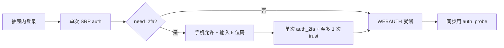
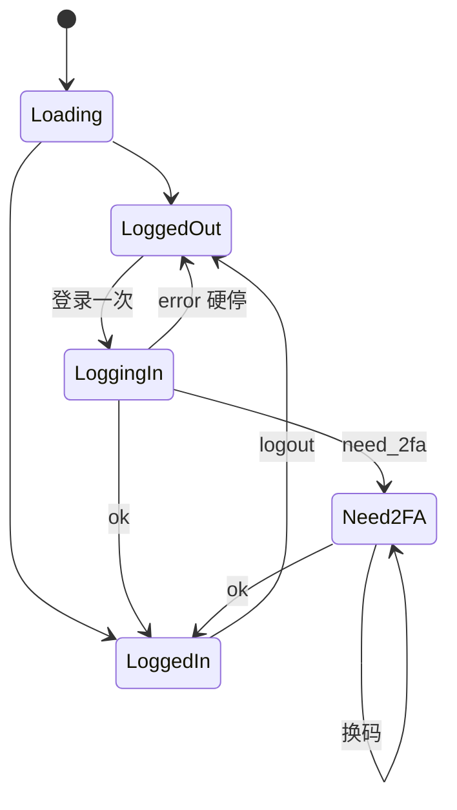
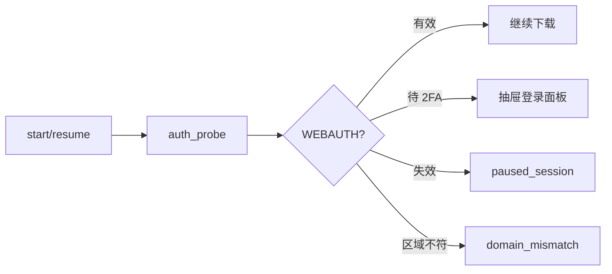

# iCloud 同步 — Apple ID 登录流程

> **职责：** 用户显式登录一次 → 拿到 WEBAUTH → 同步只用 `auth_probe`（无密码）。  
> **组件：** `components/IcloudSyncAuthPanel.vue`（抽屉内嵌）  
> **实现：** `icloud_sync/mod.rs` · sidecar `agent.py` / `icloudAuth.py`（pyicloud_ipd @ icloudpd v1.32.3）  
> **第一优先级：锁号风险最低**（少打 Apple 登录 API）  
> **对齐：** 2026-08-27

姊妹文档：[云同步](./cloudSyncFlow.md) · [本地扫描](./loadingFlow.md)

---

## 一眼看懂

| 步 | 谁做 | 说明 |
|----|------|------|
| 1 | 用户 | Apple ID/密码 → **只点一次「登录」** |
| 2 | sidecar | 单次 SRP（signin/init+complete）；触发设备验证推送 **仅 1 次**（落盘 `.mfa-kicked`，进程重启也不自动再推） |
| 3 | 用户（手机） | 点「允许」→ 看 6 位码（**无开放 API，应用代劳不了**） |
| 4 | 用户（PC） | 输入码 → `auth_2fa`（legacy POST，至多 1 次 `trust_session`）；**失败不自动重发** |
| 4b | 用户（可选） | 需要新码 → 点「重发验证码」→ `auth_2fa_resend`（显式 PUT 一次） |
| 5 | 判定 | **auth_probe 成功**（有有效 WEBAUTH）才算已登录；仅有磁盘 session 文件不够 |
| 6 | 同步 | 仅 `auth_probe`（**永不** kickoff）；失效 → 清伪 session + 用户显式重登，**禁止**后台带密码重登 |

**硬规则（改代码勿破）：**

1. 密码 SRP **仅用户显式触发一次**；同步禁止带密码 `auth`。  
2. 同一 2FA challenge **不自动重复推送**（内存 `mfa_delivery_kicked_off` + 磁盘 `.mfa-kicked`）。  
3. **禁止** `auth_2fa` 失败路径自动 rekickoff；换码只走「重发验证码」。  
4. 禁止 2FA 收尾再 `authenticate(force_refresh)` / 外层重复 accountLogin。  
5. 每条验证码：单路径校验 + **至多 1 次** trust。  
6. `account_locked` / `rate_limited` → 硬停，交给用户。  
7. **auth 失败 / 无效 probe 须清盘**，避免伪 session 触发 `already_logged_in` 或 UI 假登录。  
8. **Tauri auth / sidecar / 钥匙串命令须 `pub async fn` + `spawn_blocking`**：同步 command 跑 UI 主线程，Apple/网络一堵窗口会「未响应」。

**单次登录 Apple API 预算：** SRP×1 · 推送×1 · 提交码×1 · trust×≤1。显式重发另计。不应出现自动二次 bridge / 失败即再推 / 同步带密码。

---

## 速查

### 登录面板状态

Need2FA 时：**禁止再点「登录」**；先换码，连续失败则 logout 等待。

### 错误码

| code | 动作 |
|------|------|
| `need_2fa` | 输入验证码 |
| `auth_failed`（验码阶段） | 码错/过期：改最新码或「重发」；**勿**再点登录；**勿**当成密码错误 |
| `session_expired`（无 pending） | logout → 重新登录一轮（勿连点） |
| `session_expired`（WEBAUTH 真失效） | logout → 隔几小时再登 |
| `domain_mismatch` | 设置切 com/cn → logout → 完整重登 |
| `account_locked` / `rate_limited` | **立即停止**（MFA `tooManyCodes*` / `securityCodeLocked` 亦映射 `rate_limited`） |

> 下载 HTTP **410/404** = CDN URL 过期 → `download_failed`，**不是** `session_expired`。见 [cloudSyncFlow](./cloudSyncFlow.md)。  
> `session_expired` 仅明确会话死信号（如 `Authentication required` / 421·450）；裸验码 `(401)` → `auth_failed` 且保留 pending。  
> P0-1（HTTP 409 + `valid:true`）社区有报、本仓实机暂未复现，**暂不吸收**。

### session 探测（同步入口）

| 现象 | 是否暂停整 job |
|------|----------------|
| session_expired（未登录 / 会话死） | ✅ `paused_session` |
| need_2fa / sidecar_crashed | ✅ `paused_session` |
| auth_failed（验码错、泛登录失败） | ❌ 单文件/操作失败，**不**整 job 暂停 |
| CDN 410/404 | ❌ 单文件 failed + lookup |
| domain_mismatch | ❌ 换区域后重登 |

> sidecar「尚未 auth」类显式未登录 → `session_expired`（可 pause）；验码阶段 `auth_failed` 不打断下载队列。
> 2FA validate 后补 WEBAUTH：优先 token `accountLogin`，失败再至多一次 `trust`（避免双 `/2sv/trust`）。

---

## 细节（按需）

### 双端对照（2FA）

| 步骤 | 发生处 | 应用能否代劳 |
|------|--------|--------------|
| 推送「设备验证」 | Apple → iPhone | 触发可以，展示不行 |
| 点「允许」 | iPhone 系统 UI | **否** |
| 显示 6 位码 | iPhone | 否 |
| 输入提交 | 抽屉登录面板 | 是（`auth_2fa`） |
| 重发验证码 | 抽屉「重发验证码」 | 是（`auth_2fa_resend`，用户显式） |
| 换 WEBAUTH | sidecar | 是 |

### 登出 / 换号

- logout：清内存 + 删 session/cookie。  
- 换号：先清旧 session 再完整 auth。  
- 已登录不可再 login（防二次 SRP）→ 须先 logout。

### 实机建议

1. 重启 `cs:dev` → **退出登录**清半成品  
2. 确认已开启网页访问 iCloud、已关闭 Advanced Data Protection  
3. **登录一次** → 手机允许 → **30s 内**输码  
4. 失败：换新码；连续失败 → logout，等数小时  

### 诊断文件（应用内无面板）

失败后**先别连点登录**，打开：

`%APPDATA%\com.ll.admin\icloud-sync\session\auth-diagnostic.json`

看 `outcome` / `code` / `stage` / `hints`。常用 hint：`WEBAUTH_MISSING_AFTER_2FA`、`MISSING_SCNT_OR_SESSION_ID`、`NO_PENDING_2FA`、`stage=download*`+410 → 走 CDN 而非重登。

| 路径 | 内容 |
|------|------|
| keyring | 仅「记住我」成功登录后存密码，供下次回填；**登录 SRP 不读钥匙串** |
| `{session_dir}/{appleId}.session` | pyicloud session |
| `auth-diagnostic.json` | 最近一次认证/同步诊断（无密码/验证码） |

UI `loggedIn` 仅表示有 session 文件；**同步以 auth_probe + WEBAUTH 为准**。

### 社区参考（锁号向）

[icloudpd #1335](https://github.com/icloud-photos-downloader/icloud_photos_downloader/pull/1335) · [icloudpy #138](https://github.com/mandarons/icloudpy/pull/138) · [rclone #9324](https://github.com/rclone/rclone/issues/9324)
