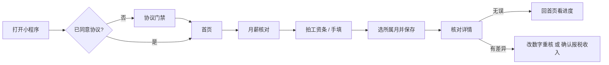

# 薪算狮产品文档

> 版本口径：以当前仓库已上线能力为准（uni 小程序 / H5 + Nest 后端）。  
> 本文面向产品、运营与研发，描述「用户能做什么」，不展开实现细节。  
> 计算结果仅供参考，不构成税务、法律或财务建议。

## 1. 产品是什么

**薪算狮**是面向职场人士的个税与工资条核对工具。口号是「算得清楚，对得明白」。

它解决两件日常问题：

1. **发工资条后**：扣的个税、到手实发对不对？和个税 App 对得上吗？
2. **谈薪 / 看 Offer 前**：这个月薪全年税后大概能拿多少？年终奖怎么计税更划算？

主入口是微信小程序（同时支持 H5 / App 打包）。导航栏标题为「智能个税测算与工资条识别」。

## 2. 定位与边界

| 维度 | 说明 |
|---|---|
| 产品形态 | C 端工具小程序，不是企业 HR / 发薪系统 |
| 核心价值 | 用累计预扣法把「工资条数字」和「税法期望」对上，并估算全年到手 |
| 主路径 | **月薪核对**（推荐） |
| 次路径 | **年薪测算** |
| 不做 | 社保基数测算、各地政策自动匹配、企业代扣代缴、劳动仲裁证据、官方报税 |


## 3. 目标用户与场景

**目标用户**：有工资条、会用个税 App 的在职人员；谈薪时想先估到手的候选人。

| 场景 | 用户想做什么 | 产品怎么接 |
|---|---|---|
| 发薪日 | 拍一张工资条，30 秒看扣款对不对 | 月薪核对：识别 → 填表 → 结论 |
| 对个税 App | 把本年各月「本期收入 / 个税」和 App 逐月对照 | 本年累计对照台账 |
| 缺某月工资条 | 先核已有月份，缺月以后再补 | 首页进度卡标缺月；核对按当月估算前序 |
| 谈薪 / Offer | 输入月薪，看全年税后和每月明细 | 年薪测算 |
| 年终奖怎么报 | 单独计税还是并入综合所得 | 测算页三种年终计税方式 |
| 发现公司少报 / 多报 | 工资条应发和报税收入对不上 | 反推报税收入，用户确认后参与后续累计 |

## 4. 信息架构

```text
首次进入
  └─ 协议门禁（用户协议 + 隐私指引）
       └─ 首页「薪算狮」
            ├─ 月薪核对（主）
            │    ├─ 拍照/相册识别工资条
            │    ├─ 核对详情（结论 / 对比 / 计算明细）
            │    ├─ 本年核对进度（首页月格）
            │    └─ 本年累计对照（与个税 App 对表）
            └─ 年薪测算（次）
                 ├─ 测算表单
                 ├─ 年度明细（到手、税额、月度拆分）
                 └─ 测算记录
```

## 5. 核心功能

### 5.1 月薪核对（主功能）

帮助用户把一张工资条核成三件事：个税对不对、税后加得上加不上、和个税 App 的报税收入是否一致。

**录入**

- 相册或相机选一张工资条，服务端识别金额明细并尝试回填表单。
- 用户可改数字；未自动对上的明细可手动指派到字段。
- 必填且须大于 0：税前应发、个人所得税、税后实发。
- 选填：个人社保、个人公积金、其他扣款（缺勤等）、专项附加扣除（月）。
- 所属月：默认上月；工资条通常次月才发，不能选当月及以后。同一用户同一自然月只保留一条核对记录，再核即覆盖。

**核对结论**

| 结论 | 用户看到的意思 |
|---|---|
| 无误 | 个税、税后都与累计预扣法重算结果一致 |
| 报税收入偏低 / 偏高 | 个税对不上，系统反推出更可能的「报税收入」，请用户对照个税 App 后确认 |
| 税后加不上 | 应发 − 社保 − 公积金 − 其他扣款 − 个税 ≠ 实发，优先改工资条数字 |
| 仅个税有差 | 专项附加或五险一金可能填错 |
| 前面月份不全 | 缺月时先按本月数字估算前序月份，结论会带说明 |

用户确认「按报税收入计入累计」后，后续月份的累计预扣会改用该金额，而不是工资条应发。可再改回工资条口径。

**本年进度与对照**

- 首页进度卡：当年 1–12 月格子（截止上月）。已核进详情，缺月带所属月去核对，未来月不可点。
- 对照表：逐月列出计入累计的收入、工资条个税、状态（无误 / 有差异 / 已按报税 / 待核 / 未到），方便和个税 App「收入纳税明细」对表。

### 5.2 年薪测算（次功能）

按「每月相同月薪 × 12」估算全年税后现金流，适合谈薪，不替代逐月核对。

**输入**

| 字段 | 说明 |
|---|---|
| 税前月薪 | 必填，默认示例 10000 |
| 年终计税方式 | 不计税 / 单独计税（默认）/ 并入综合所得 |
| 年终奖 | 可手输，或快捷「月薪 × 1 / 2 / 3 / 4 / 6 / 8 / 10」 |
| 社保（月） | 五险个人部分合计 |
| 公积金（月） | 个人月缴存 |
| 专项附加（月） | 七项合计；页内有标准说明 |

**输出**

- 全年税后到手、全年个税、税前应发总额。
- 12 个月税前 / 个税 / 税后明细，以及适用预扣率、速算扣除数。
- 年终奖税额与税后（若有）。
- 可重新测算（回填原记录并更新）；测算记录可搜索、删除。

### 5.3 历史与跨设备

- 测算、核对记录与微信账号绑定，登录后可跨设备查看。
- 核对：同一所属月覆盖更新；测算：可保存多条。
- 用户可删除单条记录。核对历史入口目前未在主路径强调，测算页提供「测算记录」。

## 6. 用户主路径

### 6.1 发薪核对



### 6.2 与个税 App 对全年

1. 尽量从 1 月起按月核工资条（首页缺月格子一键补）。
2. 打开「对照表」，用「计入累计收入」「工资条个税」去对 App 的本期收入、已缴税额。
3. 若某月个税对不上，详情会提示报税收入可能偏低或偏高；对照 App 后选择是否按报税口径计入后续月份。

### 6.3 谈薪测算

1. 首页进入年薪测算（或好友分享落地测算页）。
2. 填月薪、五险一金、专项附加；需要时选年终奖及计税方式。
3. 查看全年到手与月度拆分；可转发「输入月薪即可估算」（分享标题不带金额）。

## 7. 计税口径（产品规则）

以下是产品采用的简化模型，与真实发放、各地政策可能有偏差。

### 7.1 工资薪金：累计预扣法

本期应预扣税额 =（累计应纳税所得额 × 预扣率 − 速算扣除数）− 累计已预扣税额。

累计应纳税所得额 ≈ 累计收入 − 累计减除费用（5000 元/月 × 任职月数）− 累计专项扣除（社保+公积金个人）− 累计专项附加扣除。

综合所得七级超额累进（与现行预扣表一致）：3% / 10% / 20% / 25% / 30% / 35% / 45%。

**测算页**：假设 1–12 月月薪、五险一金、专项附加都相同。  
**核对页**：用用户已核的前序月份真实数字累计；缺月则临时用当月数字填补，并明确告知。

### 7.2 年终奖

| 方式 | 含义 |
|---|---|
| 不计税 | 奖金全额计入到手，不算年终奖个税 |
| 单独计税 | 按「奖金 ÷ 12」对照月度税率表一次性计税 |
| 并入综合所得 | 把奖金并入年度综合所得后，多出来的税记为年终奖税 |

### 7.3 核对用到的金额口径

| 概念 | 口径 |
|---|---|
| 工资条应发 | 用户填的税前月薪，用于展示和税后自洽 |
| 计入累计的收入 | 默认 = 应发 − 其他扣款；用户确认报税修正后 = 反推应发 |
| 其他扣款 | 缺勤等，减计税收入，**不是**专项附加，也**不要**填进公积金 |
| 税后自洽 | 应发 − 社保 − 公积金 − 其他扣款 − 工资条个税 |
| 比对容差 | 0.01 元 |

### 7.4 专项附加扣除（用户自填合计）

产品不自动拆七项，只收「每月合计」。页内提示的现行常见标准：

1. 3 岁以下婴幼儿照护：每孩每月 2000 元  
2. 子女教育：每孩每月 2000 元  
3. 赡养老人：独生子女每月 3000 元；非独生子女分摊且每人不超过 1500 元  
4. 住房贷款利息：每月 1000 元，最长 240 个月  
5. 住房租金：按城市分档 1500 / 1100 / 800 元  
6. 继续教育：学历每月 400 元；职业资格取得证书当年 3600 元  
7. 大病医疗：自付超 1.5 万部分，8 万限额内据实扣除  

未建模：免税收入、个人养老金、捐赠扣除、减免税额、企业年金、各地社保基数上下限。

## 8. 账号、隐私与合规

| 能力 | 产品行为 |
|---|---|
| 登录 | 微信登录（openid），历史归属到账号；请求失败时会静默补登录 |
| 首次使用 | 必须同意《用户服务协议》和《隐私保护指引》 |
| 工资条图片 | 仅用于识别；协议承诺识别完成后服务端立即删除，不持久化 |
| 薪资数字 | 用户保存后与账号一并存在服务端，用于跨设备查阅和累计预扣 |
| 识别限流 | 同一账号每个自然日（上海时区）最多成功识别 **10** 次 |
| 不收集 | 姓名、身份证号、银行卡号等敏感身份信息不作为产品输入 |
| 广告 | 未接入广告插件 |
| 分享安全 | 转发标题不带具体金额；封面用固定海报，避免截屏泄密 |
| 免责 | 结果仅供参考，不以劳动仲裁、税务申报或薪资纠纷依据 |

协议同时说明：用户可删历史；在微信里撤回授权后，应停止收集并删除服务端历史。

## 9. 增长与渠道

- 页面 query `from=` 记录拉新渠道（字母数字、下划线、短横线，最长 32 位）。
- 微信转发落地：核对页或测算页，顶栏提示「好友在…」，避免空表无语境。
- 默认分享渠道码为 `share`。

## 10. 功能清单（对产品/测试）

| 模块 | 功能点 | 优先级 |
|---|---|---|
| 准入 | 协议门禁、协议正文、同意后回跳分享落地页 | P0 |
| 首页 | 月薪核对入口、年薪测算入口、本年进度月格、对照表入口 | P0 |
| 核对录入 | 拍照/相册、OCR 回填、手动改数、未映射项指派、所属月、三项必填 | P0 |
| 核对详情 | 结论卡、差异主因、项目对比、累计预扣明细、确认/撤销报税口径、重新核对 | P0 |
| 全年对照 | 12 月台账、计入累计收入、个税合计、待核跳录入 | P0 |
| 年薪测算 | 表单、倍数年终奖、七项说明、全年结果、月度图/表、重新测算 | P0 |
| 历史 | 测算记录列表、搜索、下拉刷新、滑动删除 | P1 |
| 账号 | 微信登录、历史跨设备、删除记录 | P0 |
| 识别 | 图片压缩上传、识别失败提示、倾斜/低置信度提示、日限额 | P0 |
| 分享 | 不带金额标题、渠道 from、落地提示 | P1 |
| 彩蛋工具 | 工作台三项生活工具 | P2 |

## 11. 已知限制（对用户沟通）

1. 各地社保公积金政策、企业年金、个人养老金等未纳入，到手可能和公司实发不一致。  
2. 测算默认「全年月薪不变」；真实跳槽、调薪、年中入职要用核对逐月记，不能只靠一次测算。  
3. 缺月时前序按本月估算，缺得越多，当月个税结论越不准。  
4. 工资条版式差异大，识别可能漏项或错配，用户必须以条上数字为准再核。  
5. 反推报税收入是数学近似，需用户自己对照个税 App 后确认。  
6. 产品不是官方办税渠道，不能替代个人所得税 App 申报。
